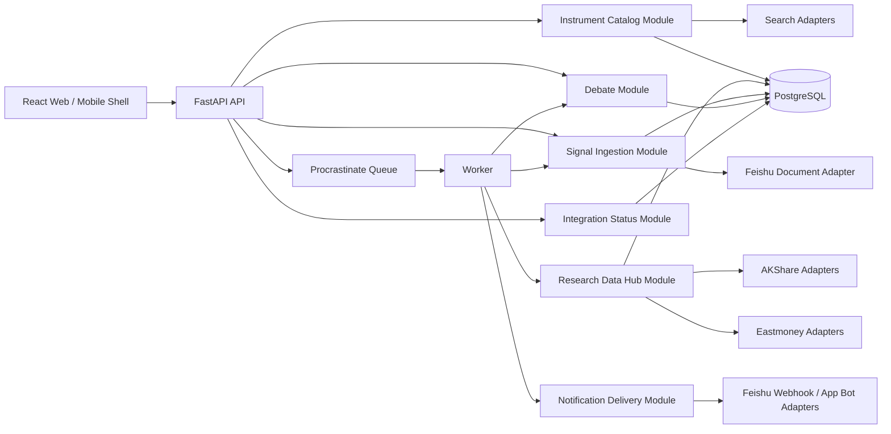

# 投研工作台：全栈重构后下一步迭代技术方案

> 方案日期：2026-07-29  
> 评审基线：`main@2da044e`  
> 输入材料：`全栈重构后产品与技术评审报告-2026-07-29.md`、`投研工作台全栈重构技术方案.md`、当前代码实现、产品负责人补充意见  
> 方案状态：建议执行稿  
> 产品口径：个人主导、允许小范围可信账号访问的 AI 投研工作台；多用户能力服务于访问隔离与 BYOK，不扩展为团队协作 SaaS

---

## 1. 执行摘要

下一轮围绕四条主线形成完整产品闭环：

1. **将 AKShare 建设成研究数据枢纽的核心 Adapter**：保留依赖，接通采集、标准化、存储、时点查询、证据消费和运行监控；从宏观扩展到基金、指数、股票事件、商品与衍生品数据。
2. **让辩论支持任意合法标的**：建立统一的 Instrument Catalog Module，搜索、规范化、公共证券身份创建和证据能力探测全部由服务端完成；持仓与自选保留为快捷入口。
3. **恢复飞书信号接入**：把现有“文档抓取 + LLM 抽取 + 信号入库”从日更附属步骤升级为独立、可观测、可重跑、支持同日修订的数据源任务；通知投递与信号接入分开管理。
4. **将移动端重构为触屏工作台**：保留现有业务状态和视觉系统，新增 Mobile Shell、Bottom Sheet、Pull to Refresh、Swipe Action Row、Long Press Menu 等交互 Module，按移动任务流重新组织核心页面。

同时完成五项架构收口：

- `/jobs/daily` 全面入队，HTTP 只返回任务运行 ID；
- 用户管理、停用、会话撤销和改密闭环；
- LLM JSON 解析统一，修复 provider 反向依赖 service；
- 辩论角色使用注册表集中声明，图结构继续显式；
- 统一 README、AGENTS 和技术方案的产品定位，保留仍在使用的 `report:import`。

本轮继续使用 PostgreSQL、Procrastinate Worker、FastAPI、React 和 TanStack Query。现有 API/Worker 分进程、加密检查点、密钥分离和 TLS 具备实际可靠性价值，予以保留。基础设施进入冻结期，不增加 Redis、Kafka、独立数据仓库、原生 App 或复杂团队协作能力。

---

## 2. 对评审结论的处理

| 评审事项 | 本方案结论 | 处理方式 |
|---|---|---|
| AKShare 与宏观持久化链路无消费 | 结论成立，产品决策选择“启用并深化” | 接通 M6，扩展为 Research Data Hub |
| 辩论只能选择持仓/自选 | 结论成立 | 任意搜索、服务端解析、显式加入自选 |
| 飞书真实链路可能未落地 | 产品感知成立；代码链路仍存在 | 增量同步、运行台账、状态 UI、真实环境验收 |
| 移动端缺少底部导航 | 结论成立，改造范围扩展到完整触屏任务流 | Mobile Shell + 局部手势 Module + 页面重组 |
| 用户管理与改密缺失 | 结论成立 | 本轮可靠性收口阶段完成 |
| `/jobs/daily` 阻塞 API | 结论成立 | 改为 Worker 任务，返回 `202 + run_id` |
| 辩论角色声明分散 | 结论成立 | 单一角色注册表，图边保持显式 |
| 基础设施偏重 | 当前运行价值高于重写收益 | 保留现状，停止继续扩张 |
| 建议删除 `report:import` | 当前仍承担显式报告入库职责 | 保留并更新文档，不创建第二条导入路径 |
| 建议立即启用 RLS | 现阶段收益低于实施与运维成本 | 暂缓；先统一 owner-scope 查询 Helper 与测试 |

### 2.1 本轮不做

- 不接入 AKShare 的全部接口；
- 不建设通用低代码数据平台；
- 不做 PWA 离线、原生 iOS/Android App；
- 不增加评论、审批、团队空间和匿名分享；
- 不引入全局页面左右滑动导航；
- 不重写已经稳定的队列、检查点、鉴权和部署链路；
- 不用抓取时间冒充宏观指标发布时间；
- 不自动把任意辩论标的加入自选。

---

## 3. 当前实现与目标差距

| 领域 | 当前实现证据 | 目标状态 |
|---|---|---|
| AKShare | `AksharesMacroProvider`、`MacroSeries`、`MacroObservation` 已存在；无生产写入者；辩论直接调用东财宏观实时抓取 | Worker 定时采集，多源标准化入库，按 `as_of` 消费；AKShare 覆盖多个高价值证据面 |
| 任意标的 | 前端只合并持仓与自选；后端强制当前用户存在 Position 或 WatchlistItem | 搜索任意合法证券，解析为公共 `Instrument` 后发起私有辩论 |
| 飞书信号 | 手动接口和日更均可调用；未配置时静默跳过；某日已有任意飞书信号后永久跳过该日 | 独立队列任务、内容指纹、同日修订、运行台账、错误可见、日期回补 |
| 飞书通知 | webhook/app-bot 两种方式已实现，缺少状态与投递历史 | 明确通道优先级，展示最近成功/失败，真实测试消息由用户显式触发 |
| 移动端 | CSS 断点将网格变单列；顶部七项横向滚动；已有 44px 触控尺寸 | 底部主导航、触屏筛选与详情、局部滑动、下拉刷新、长按菜单、安全区与软键盘适配 |
| 日更任务 | API 请求内等待长任务 | API 原子入队，Worker 执行，页面跟踪运行状态 |
| 多用户闭环 | 有用户状态、邀请与会话基础；无成员管理与改密 UI | 成员列表、停用/启用、会话撤销、本人改密 |

---

## 4. 架构原则与领域语言

本方案使用以下架构词汇，后续代码评审按同一口径判断：

- **Module**：对调用方暴露少量能力、内部承载较多策略的业务模块。
- **Interface**：Module 对调用方承诺的稳定能力与数据契约。
- **Implementation**：Provider 调用、字段映射、重试、缓存、修订、数据库读写等内部细节。
- **Depth**：Interface 足够小，隐藏的 Implementation 足够多。
- **Seam**：可替换或可测试的边界，例如 AKShare 与东财 Provider 的切换点。
- **Adapter**：把外部系统的数据与错误语义转换为内部契约的实现。
- **Leverage**：一次实现能服务多少消费者。
- **Locality**：同一业务知识集中维护，变更无需跨多处同步。

### 4.1 目标架构



### 4.2 依赖方向

```text
api → services/modules → provider interfaces → provider adapters
                    ↘ models/repositories

worker/tasks → services/modules
agents/debate → ResearchDataHub Interface
frontend pages → interaction components + query hooks
```

业务代码不得直接 `import akshare`，飞书文档读取与飞书消息发送不得共用一个含混的“飞书服务”。每种外部能力通过独立 Interface 接入。

---

## 5. Module A：Research Data Hub，深度利用 AKShare

> 数据事实与接口清单见 `数据底座接入调研-AKShare能力与消费缺口映射-2026-07-29.md`。本节负责把调研结论收束为 Module、Interface、数据语义、来源路由、存储和验收契约。

### 5.1 产品目标与架构定位

AKShare 的战略价值包含两部分：

1. **补齐真实消费缺口**：宏观流动性、指数/ETF 成分与估值、个股历史估值、客观事件等当前证据面；
2. **降低上游集中度**：通过 AKShare 接入中证、中债、巨潮、申万、交易所等来源，减少行情、基金、基本面和宏观数据对东财上游的集中依赖。

AKShare 是外部数据 Adapter 的集合，不代表单一上游。`stock_value_em` 通过 AKShare 调用后仍属于东财来源；`index_stock_cons_weight_csindex`、`bond_china_yield` 和 `stock_report_disclosure` 分别属于中证、中债和巨潮来源。来源选择必须按具体 capability 决定。

Research Data Hub Module 负责：

- 维护研究数据语义与能力目录；
- 在 capability 对应的真实 Seam 上选择 Adapter；
- 采集、标准化、修订去重和来源留痕；
- 统一观察期、发布时间、可用时间、生效时间与抓取时间；
- 将类型化事实投影为辩论、日报、组合分析和压力监控需要的 `EvidenceBundle`；
- 返回新鲜度、来源冲突和结构化 `data_gap`；
- 隐藏 DataFrame、外部字段、函数名、认证、重试和降级 Implementation。

删除该 Module 后，来源选择、时点过滤、修订、质量判断和降级逻辑会重新散落到每个消费者，Deletion test 证明其具备足够 Depth、Leverage 与 Locality。

### 5.2 收紧 Module Interface

研究证据读取与数据源运维面向不同调用方，拆成两个深 Module：

```python
class ResearchDataHub(Protocol):
    async def evidence(self, request: EvidenceRequest) -> EvidenceBundle: ...


class SourceOperations(Protocol):
    async def refresh(self, request: RefreshRequest) -> SourceRunRef: ...
    async def health(self, capability: str | None = None) -> list[SourceHealth]: ...
```

`ResearchDataHub` 是辩论、日报、组合分析和压力监控使用的 Interface。调用方只声明：

```text
subject                 # Instrument / Portfolio / Market / MacroRegion
as_of
consumer                # debate / daily_briefing / portfolio / pressure
required_capabilities
freshness_policy
```

`SourceOperations` 是 Worker、Tasks 和 Settings 使用的 Interface，负责刷新、回补、运行台账和健康状态。业务消费者无需了解刷新模式、Adapter 名称或来源认证。

`EvidenceBundle` 至少携带：

```text
facts
provenance
as_of
freshness               # fresh / stale / expired / missing
conflicts
data_gaps
source_run_ids
```

同一份 `EvidenceBundle` 中每个事实必须能追溯到实际 Adapter、上游来源、版本和时间语义。

### 5.3 Capability 语义与来源注册表

新增静态、类型化的 `EvidenceCapabilityRegistry`，集中登记：

```text
capability_key
semantic_key
subject_kinds
asset_classes
value_type
unit
frequency
observation_period_rule
availability_policy
refresh_policy
freshness_sla
stale_policy
normalizer_schema_version
quality_rules
consumers
source_routes[]
```

每条 `source_routes` 包含：

```text
adapter
upstream_family
upstream_source
source_priority
equivalence_group
auth_mode
expected_fields
historical_point_in_time_support
```

#### 语义键规则

`capability_key` 必须表达完整经济含义，禁止用裸 `cpi`、`valuation`、`fund_flow` 代表多个口径：

```text
macro.cn.cpi.yoy.monthly
macro.cn.cpi.mom.monthly
macro.cn.pmi.manufacturing.absolute.monthly
rate.cn.shibor.on.daily
rate.cn.gov_bond_yield.10y.daily
valuation.stock.pe_ttm.daily
index.constituents.weight.monthly
event.stock.earnings_forecast
```

当前 AKShare Adapter 把 `macro_china_cpi_monthly` 的 CPI 环比登记为 `cpi`，东财 Adapter 的 `cpi` 为 CPI 同比。两者不能互为主备，实施第一步必须拆分语义键和 `value_type`。

只有 `equivalence_group` 一致、单位和频率兼容、观察期与可用时间规则相同的来源，才允许自动降级。语义不等价的数据可以并列展示或参与交叉验证，不参与静默替换。

### 5.4 消费拉动的接入优先级

| 优先级 | 数据能力 | 首批数据 | 直接消费者 | 验收输出 |
|---|---|---|---|---|
| P0 | 宏观与流动性 | CPI、PPI、PMI、GDP、M2、社融、LPR、SHIBOR、国债曲线 | 宏观分析师、日报、组合风险背景 | 类型化序列、真实或保守可用时间、来源分歧 |
| P0 | 指数与 ETF | 中证成分权重、申万行业、指数估值 | 任意 ETF/指数辩论、组合行业归因 | 成分与权重快照、行业映射、估值时序 |
| P1 | 个股历史估值 | PE-TTM、PB、PEG、PS 及历史分位 | 基本面分析师、持仓分析 | 估值时序、分位区间、样本期 |
| P1 | 客观事件 | 业绩预告/快报、实际披露、解禁、股东/高管增减持、股本变化 | 基本面、裁判、风险审查 | 事件时间、公告来源、影响标的 |
| P1 | 基金多源互证 | 净值、资产配置、持仓、规模、经理 | 基金持仓、任意基金辩论 | 来源差异、披露期、十大/完整持仓口径 |
| P2 | 市场行为 | 龙虎榜、资金流、北向持股 | 情绪面、事件下钻 | 低置信度行为事实与明确口径 |
| P2 | 商品、期权、另类数据 | 库存、仓单、基差、IV、Greeks、行业高频指标 | 有相关持仓或研究命题时接入 | 每项先有消费者与口径 ADR |

“客观事件”与“市场行为”分开建模。业绩预告、公告、解禁和持股变化具有明确事件时间；龙虎榜、资金流表达交易行为，解释稳定性与因果强度较低。

每个 capability 上线前必须至少登记一个真实消费者。基金、商品、期权和另类数据按当前持仓、自选、任意辩论覆盖率与 `data_gap` 统计继续排序。

### 5.5 按 Capability 路由来源

来源路由遵循以下顺序：

1. 先校验语义、报告期、单位和发布时间能力；
2. 在语义等价的来源中，优先采用上游权威、时点完整、授权清晰的来源；
3. 使用运行健康度和新鲜度调整可用路由；
4. 主来源失败时只切换到同 `equivalence_group` Adapter；
5. 多来源数值超出质量阈值时保留冲突，不静默选边；
6. `EvidenceBundle` 记录实际选择的来源与降级原因。

典型路由：

| Capability | 首选来源候选 | 互证/降级来源 | 说明 |
|---|---|---|---|
| 中债收益率曲线 | AKShare → 中债 | 经验证的备用源或旧有效快照 | 官方上游优先 |
| 中证成分权重 | AKShare → 中证 | 国证/申万对应指数；旧有效快照 | 不同指数体系不得互换 |
| A 股财报披露时间 | 数据记录自身 `NOTICE_DATE` | AKShare → 巨潮实际披露 | 匹配失败进入 `data_gap` |
| 个股估值时序 | AKShare → 东财 `stock_value_em` | 现有东财或其他语义等价 Adapter | 扩充数据广度，不能降低东财上游集中度 |
| 宏观报告期数值 | NBS/东财面板等经验证来源 | 语义等价来源 | 与发布事件分别存储 |
| 宏观发布事件 | AKShare → 金十事件日历 | 官方日历/保守可用时间 | 不直接覆盖报告期 |

#### 来源健康度

GitHub issue 用于建立故障类型库，不能直接充当稳定性概率。来源排序使用实际运行数据：

```text
success_rate_7d
success_rate_30d
freshness_lag
empty_response_rate
schema_drift_count
row_count_anomaly
source_conflict_rate
captcha_or_auth_failure
last_success_at
```

官方来源在首次接入时获得较高的路由先验，运行数据持续校准该先验。熔断、恢复和降级结果进入 `source_sync_runs`。

#### 认证与反爬约束

- 不建设自动 Cookie 池、验证码绕过和账户池；
- 来源条款允许时，可由管理员提供人工配置的 Cookie Secret；
- Cookie、Token 和登录态只进入部署 Secret，不进入数据库展示字段；
- 验证码或认证失败将来源标记为 unavailable，路由选择官方来源、语义等价 Adapter 或旧有效快照；
- 实时接口按交易时段调用，非交易时段空结果与异常失败分开记录。

### 5.6 AKShare 版本与能力清单

当前存在三个版本口径：

| 口径 | 版本 |
|---|---|
| 项目 `backend/uv.lock` 实际锁定 | 1.18.64 |
| 数据调研使用的上游版本 | 约 1.18.74 |
| 本方案撰写时官方文档展示版本 | 1.18.81 |

实施前选择一个明确目标版本，并在独立提交中完成：

1. `pyproject.toml` 从 `akshare>=1.15.0` 改为精确版本；
2. 更新 `uv.lock`；
3. 新增 `akshare_capabilities` manifest；
4. 验证候选函数存在；
5. 验证函数参数、返回列、单位、日期语义和上游来源；
6. 对最小样本运行真实 smoke；
7. 保存脱敏 fixture；
8. 通过普通测试后再进入领域接入。

manifest 示例：

```text
capability_key
akshare_function
runtime_version
parameters
required_columns
optional_columns
upstream_url
fixture_version
last_live_smoke_at
```

已从目标版本移除的 `stock_a_indicator_lg`、`index_value_hist_funddb` 不进入实现。实际函数、字段和来源以选定运行版本为准。

### 5.7 三层数据模型

采用“原始回执 → 类型化事实 → 消费投影”三层模型，全部保留在现有 PostgreSQL。

#### 第一层：原始来源回执

新增内部表 `source_payload_snapshots`：

```text
id
source_run_id
capability_key
adapter
upstream_family
upstream_source
subject_key
request_fingerprint
retrieved_at
schema_version
payload_hash
payload_json
row_count
expires_at
```

用途：

- Adapter 解析重放；
- 字段漂移排查；
- 修订审计；
- fixture 更新依据。

业务消费者不得直接查询该表。原始 payload 按 capability 设置保留期，避免无限增长。

#### 第二层：类型化事实

继续使用或按消费需求新增：

```text
macro_series / macro_observations
macro_release_events
instrument_metric_series / instrument_metric_observations
instrument_events
index_constituent_snapshots / index_constituent_items
fund_holding_snapshots / fund_holding_items
daily_bars / fund_nav
```

类型化事实表负责唯一约束、时点查询、分位计算、事件过滤和跨来源比较。成熟数据域直接落类型化事实表，不再先写通用 `evidence_snapshots`。

#### 第三层：消费投影

Research Data Hub 按 `EvidenceRequest` 从类型化事实生成 `EvidenceBundle`：

- 辩论：按标的与 `as_of` 组装四面证据；
- 日报：按市场和本地日期组装宏观、指数与事件背景；
- 组合分析：按持仓聚合行业、估值和风险暴露；
- 压力监控：按主题映射行情、资金与事件。

消费投影可短期缓存，缓存只承担性能优化；类型化事实表是唯一事实来源。

### 5.8 双时间与 Point-in-time 规则

所有研究事实明确区分：

```text
observation_period        # 数据描述的月份、季度或交易日
source_published_at       # 上游报告的发布时间
available_from            # 系统允许消费者使用的时间
effective_at              # 政策/事件开始生效时间，可空
retrieved_at              # 本系统抓取时间
release_precision         # date / datetime
release_confidence        # official / source_reported / inferred / unknown
```

铁律：

- `retrieved_at` 不得冒充发布时间；
- 只有日期、没有时分秒时，使用保守 `available_from`，首版按次日 `00:00 Asia/Shanghai`；
- `release_confidence=unknown` 的数据不得进入历史 `as_of` 决策；
- 同观察期修订选择 `available_from <= as_of` 的最新版本；
- 修订哈希包含 `semantic_key + observation_period + value + unit + source_published_at + schema_version`；
- 预测值、前值和实际值分字段保存；
- 政策公布时间与生效时间同时存在时分别保存。

#### 宏观数值与发布事件

金十接口的“日期、今值、预测值、前值”作为 `macro_release_events`；NBS/东财等“报告期→数值”面板作为 `macro_observations`。两者按以下规则关联：

1. `semantic_key` 完全一致；
2. 按指标日历推导候选观察期；
3. 实际值、单位与频率通过容差校验；
4. 关联成功后，观测使用事件的保守 `available_from`；
5. 关联失败时保留两条事实并产生 `data_gap`；
6. 未来预测行只进入经济日历，不进入已发布观测。

不得将金十事件日期同时写作 `observation_period`。

#### 财报与事件

- 财务数据记录自身带 `NOTICE_DATE` 时优先使用；
- 缺少公告时间时，按证券、报告期和报告类型关联巨潮 `stock_report_disclosure` 的实际披露日；
- 只有报告期、无法关联披露时间的记录不能进入历史 point-in-time 证据；
- 预约披露及历次变更作为日历事实，实际披露作为可用时间依据；
- 解禁等事件同时保存公告时间与实际生效时间。

### 5.9 消费契约

每个 capability 上线必须同时交付：

1. Adapter；
2. manifest 与 fixture；
3. 类型化事实存储；
4. Research Data Hub 投影；
5. 明确消费者；
6. Prompt 或确定性计算逻辑；
7. 页面来源展示；
8. 时点、修订、冲突、降级和缺口测试。

首轮保持四分析师结构：

| 分析角色 | 新增消费 |
|---|---|
| technical | 继续消费日线计算结果 |
| fundamental | 历史估值、估值分位、财务指标、业绩预告、解禁、股东变化 |
| macro | CPI/PPI/PMI/GDP/M2、社融、利率和国债曲线 |
| sentiment | 飞书信号及低置信度市场行为 |
| judge / risk | 来源冲突、客观事件、可用时间与 `data_gap` |

宏观 Prompt 当前写死五个指标。宏观能力扩展时必须同步调整 Prompt、有效证据判断、报告模板和测试。首轮不增加第五个“事件分析师”，客观事件先进入基本面、裁判和风险审查。

### 5.10 垂直实施切片

#### A. 版本与能力基线

- 选择并精确固定 AKShare 版本；
- 建立 manifest 和 live smoke；
- 建立 `EvidenceCapabilityRegistry`；
- 拆分 CPI 同比/环比等语义键；
- 建立 `source_sync_runs` 与来源健康指标。

退出条件：

- 所有首批函数在目标运行版本存在；
- 参数和返回列 fixture 通过；
- 调研清单与运行 manifest 一致。

#### B. 宏观与流动性闭环

- 建立 `macro_release_events`；
- 接入社融、LPR、SHIBOR、国债曲线；
- 修复观察期与发布时间混用；
- Worker 定时刷新与修订去重；
- Research Data Hub 按 `as_of` 返回宏观证据；
- 辩论、日报和持仓分析移除实时宏观直连。

退出条件：

- CPI/PPI/PMI/GDP/M2/社融/利率均有类型化事实；
- 同一宏观事实一次采集、多消费者复用；
- 历史时点查询无未来数据；
- 单来源失败按等价来源或旧有效快照降级。

#### C. 指数与 ETF

- 接入中证成分权重、申万分类与指数估值；
- 建立成分及权重快照；
- 与 Instrument Catalog 的指数/ETF 身份映射打通；
- 为任意 ETF/指数辩论和组合行业归因提供 EvidenceBundle。

退出条件：

- 中证 300 类指数完成成分权重回读；
- 任意 ETF/指数辩论能显示成分、行业和估值来源；
- 指数体系不发生静默替换。

#### D. 个股估值与客观事件

- 接入 `stock_value_em` 及历史分位；
- 首批接入业绩预告、实际披露和解禁；
- 建立 `instrument_metric_*` 与 `instrument_events`；
- 基本面、裁判和风险审查开始消费。

退出条件：

- 估值分位带样本区间；
- 客观事件有公告时间、来源和影响标的；
- 缺少 point-in-time 时间的财务事实不会进入历史证据。

#### E. 基金与条件式扩展

- 基金数据先承担现有东财画像的互证与披露口径补充；
- 当前持仓或任意辩论产生真实缺口后再接商品、期权和另类数据；
- ETF PCF、期权 PCR、期货展期收益采用自建计算或经批准的外部源，并单独记录 ADR。

### 5.11 来源治理与测试面

- 每个 Adapter 保存脱敏真实 fixture，普通测试不访问公网；
- 关键接口提供独立 `live smoke`；
- 有限重试、指数退避、单接口超时、并发上限和错峰调度；
- 空结果、非交易时段、认证失败、Schema 漂移和网络失败使用不同错误码；
- 保存 Adapter、上游来源、URL、抓取时间、观察期、发布时间、可用时间和修订哈希；
- 运行台账记录抓取、解析、写入、修订、冲突、缺口和失败；
- 合法性与授权按上游来源分别审核；
- AKShare 代码采用 MIT 许可不代表上游数据具备相同授权；
- 未来公开商业化前逐来源复核条款。

Interface 即主要测试面：

```text
refresh → typed facts → evidence(as_of) → provenance/conflict/data_gap
```

必须覆盖：

- 语义不等价来源不能自动降级；
- 同期修订与历史 `as_of`；
- 日期精度的保守可用时间；
- 来源冲突；
- Schema 漂移；
- 旧有效快照降级；
- 目标版本函数移除；
- 同一事实被多个消费者复用。

### 5.12 主要代码落点

- `backend/app/providers/akshare_macro.py`
- `backend/app/providers/macro.py`
- `backend/app/providers/eastmoney_macro.py`
- 新增 `backend/app/providers/akshare/` 下的宏观、基金、指数、股票事件、商品、期权 Adapter
- 新增 `backend/app/services/research_data_hub.py`
- 新增 `backend/app/services/source_operations.py`
- 新增 `backend/app/services/evidence_registry.py`
- `backend/app/services/instrument_evidence.py`
- `backend/app/services/automation.py`
- `backend/app/models/macro.py`
- 新增 `backend/app/models/source_payload.py`
- 新增 `backend/app/models/instrument_metric.py`
- 新增 `backend/app/models/instrument_event.py`
- 新增 `backend/app/models/index_constituent.py`
- 新增 `backend/app/models/fund_holding.py`
- `backend/app/tasks.py`
- `backend/pyproject.toml`
- `backend/uv.lock`

---

## 6. Module B：Instrument Catalog，辩论支持任意标的

### 6.1 产品契约

- 用户可以搜索并选择任意可识别的股票、ETF、基金、指数、债券、期货或期权标的；
- 持仓、自选和最近辩论提供快捷入口；
- 首次出现的标的由服务端解析并创建公共 `Instrument`；
- 辩论、报告和用户操作仍按 `owner_id` 私有隔离；
- 证据局部缺失时允许发起，界面提前显示证据覆盖度；
- 无法规范化身份、来源明确不支持或存在歧义时拒绝创建；
- 辩论完成后可显式“加入自选”。

### 6.2 Interface 与数据模型

```python
class InstrumentCatalog(Protocol):
    async def search(
        self,
        query: str,
        *,
        asset_classes: set[AssetClass] | None,
        limit: int,
    ) -> list[InstrumentCandidate]: ...

    async def resolve(
        self,
        candidate: ProviderInstrumentRef,
    ) -> InstrumentResolution: ...

    async def capabilities(
        self,
        instrument_id: UUID,
    ) -> EvidenceCoverage: ...
```

建议新增明确的 Provider 引用表：

```text
instrument_provider_refs
  instrument_id
  provider
  external_id
  market
  metadata_json
  created_at / updated_at
  UNIQUE(provider, external_id)
```

现有 `provider_ids` JSON 在迁移完成后删除，避免公共证券身份出现重复或无法建立数据库唯一约束。

### 6.3 API

```http
GET  /api/v1/instruments/search?q=宁德时代&asset_class=stock
POST /api/v1/instruments/resolve
GET  /api/v1/instruments/{instrument_id}/evidence-coverage
POST /api/v1/debates
```

`POST /instruments/resolve` 只接受搜索结果携带的受控 Provider 引用。后端完成代码、市场、资产类型和 Provider ID 的规范化，幂等返回 `instrument_id`。

`POST /debates` 继续只接受 `instrument_id`。删除“必须属于当前用户持仓/自选”的限制，保留以下校验：

- `Instrument` 为 active；
- 证券身份已通过 Catalog 解析；
- 当前没有同用户、同标的的活动辩论；
- 当前用户具备有效的 LLM 路由；
- 创建辩论与 Worker 入队仍处于同一事务。

### 6.4 前端流程

桌面端目标选择器：

1. 第一行展示持仓、自选、最近辩论；
2. 输入名称或代码后搜索任意标的；
3. 结果展示名称、代码、市场、资产类型；
4. 选择后加载证据覆盖度；
5. 展示“完整 / 部分 / 有明显缺口”的解释；
6. 用户确认后解析 Instrument 并发起辩论。

移动端使用全屏或大尺寸 Bottom Sheet：搜索框固定在顶部，结果区可滚动，主操作固定在底部，软键盘弹出时仍能看到当前选择和“开始辩论”。

### 6.5 验收

- 未加入持仓/自选的 A 股可以成功发起辩论；
- 基金和指数各完成一条端到端辩论；
- 同一公共 Instrument 可被不同用户复用，辩论彼此隔离；
- 同代码、不同市场或资产类型不会误合并；
- 无效 Provider 引用与客户端伪造 `secid` 被拒绝；
- 首次解析与重复解析幂等；
- 任意标的不会自动进入自选；
- 证据缺失形成结构化 `data_gap`，辩论报告显示降权依据；
- 前端搜索处理乱序响应、空结果、网络错误和键盘操作。

---

## 7. Module C：恢复飞书信号接入

### 7.1 职责拆分

建立两个独立 Module：

1. **Signal Ingestion Module**
   - 读取飞书 Wiki/Docx；
   - 按日期或章节切分；
   - 比较内容指纹；
   - 调用用户配置的 LLM 抽取；
   - 标准化并写入公共信号池；
   - 记录运行结果。
2. **Notification Delivery Module**
   - 发送每日压力摘要、跨阈值告警和未来的任务完成通知；
   - 管理 webhook/app-bot Adapter 优先级；
   - 记录通道、消息类型和投递结果。

飞书 App ID/Secret、Webhook 继续来自部署 Secret。文档地址、启用状态和调度策略可作为非敏感配置展示，任何页面和日志均不得回显凭据。

### 7.2 增量与修订语义

当前“某日期已有任何飞书信号就跳过”的规则改为内容指纹：

```text
document_revision
  → section/date split
  → section_hash compare
  → changed sections only
  → extract and validate
  → append new revision
  → mark previous revision superseded
```

`community_signals` 增加：

```text
source_key
source_item_key
source_revision
superseded_at
```

旧信号不物理删除，已有 `user_signal_states` 保持可追溯；默认查询只显示未被替代的最新版本。来源修订失败时，旧的有效版本继续服务消费者。

### 7.3 统一运行台账

新增通用 `source_sync_runs`，同时服务 AKShare 和飞书：

```text
id
source_key
trigger               # schedule / manual / backfill / dependency
mode                  # incremental / force / backfill
status                # queued / running / succeeded / partial / failed
cursor_or_revision
started_at / finished_at
fetched_count
changed_count
written_count
skipped_count
error_code
safe_error_message
metadata_json
```

通用台账只承载运行生命周期。AKShare 的时点规则留在 Research Data Hub，飞书的章节与修订规则留在 Signal Ingestion Module。

### 7.4 API 与任务

```http
POST /api/v1/signals/sync
     { "mode": "incremental", "date_from": null, "date_to": null }
     → 202 { "run_id": "..." }

GET  /api/v1/signals/sync-runs/latest
GET  /api/v1/signals/sync-runs/{run_id}
GET  /api/v1/settings/integrations/feishu
POST /api/v1/settings/integrations/feishu/test-source
POST /api/v1/settings/integrations/feishu/test-notification
```

- HTTP 请求只做鉴权、参数校验和原子入队；
- 日更调用同一个队列任务，不再内嵌另一套同步逻辑；
- 支持日期区间回补；
- 支持对失败日期重试；
- “测试通知”会产生真实外部消息，必须由超管显式点击并二次确认；
- 来源连通性检查只读取文档元数据，不触发 LLM 和写库。

### 7.5 UI

Signals 页面增加来源状态区：

- 当前启用状态；
- 文档来源；
- 最近成功时间；
- 最近运行状态；
- 扫描天数、变化天数、写入数量；
- 失败阶段和可安全展示的原因；
- “增量同步”“按日期回补”入口。

Settings 页面增加两张卡片：

- **信号来源**：配置完整度、最近读取、最近抽取；
- **通知通道**：当前 Adapter、最近成功、最近失败、显式测试。

Tasks 页面显示飞书同步是否参与日更及其子运行状态。来源未配置时显示“未配置”，不得以“成功且写入 0 条”表达。

### 7.6 验收

- 相同文档重复同步零重复写入；
- 同一日期内容改变后生成新版本，旧版本被标记替代；
- 单个日期抽取失败不损坏其他日期和旧快照；
- 日期回补可重复执行；
- 手动同步立即返回 202，API 事件循环不承担抓取与 LLM；
- 信号同步失败不会阻断无关的日报步骤，最终日更状态为 partial 并清晰列出；
- webhook 与 app-bot 选择规则可测；
- 本地与云端分别验证配置状态；
- 经用户确认后向指定测试群发送一次测试消息并回读成功状态。

---

## 8. Module D：移动触屏工作台

### 8.1 总体原则

- 使用 CSS media query、`pointer`/`hover` 能力和布局空间决定交互，不依赖 User-Agent；
- 桌面与移动共享业务状态、API 和 Query Cache；
- 页面通过触屏交互 Adapter 呈现不同任务流；
- 手势用于加速操作，每个手势都有可见按钮或“更多”菜单；
- 全局路由不使用左右滑动，保留 iOS 边缘返回、图表拖动和横向内容滚动；
- 单次滑动不得直接永久删除数据；
- 默认页面 `touch-action: pan-y`，只有明确的局部组件接管横向手势；
- 保留 `prefers-reduced-motion`、强制颜色、键盘和屏幕阅读器支持。

### 8.2 Mobile Shell

底部 Tab Bar 放置五个入口：

| Tab | 入口 |
|---|---|
| 今日 | `/today` |
| 决策 | `/decisions` |
| 组合 | `/portfolio` |
| 知识 | `/knowledge` |
| 更多 | Bottom Sheet：信号、任务、设置、账户、退出 |

实现要求：

- 使用 `padding-bottom: env(safe-area-inset-bottom)`；
- 正文为底栏预留空间；
- 当前 Tab 有文本与图标双重状态；
- 页面切换后焦点和滚动位置符合路由预期；
- 超管入口按权限出现在“更多”中；
- 顶栏保留页面标题和一项主要操作；
- 行情条改为原生横向滑动 + `scroll-snap`，桌面箭头作为增强功能。

### 8.3 交互 Module

#### BottomSheet

- 支持拖拽关闭、遮罩点击、Esc、焦点圈定；
- 自动适配 `visualViewport` 与软键盘；
- 三档高度：内容自适应、半屏、近全屏；
- 拖动过程中锁定轴向，页面背景不跟随滚动；
- reduced-motion 下取消弹簧动画。

#### PullToRefresh

- 仅在主滚动容器 `scrollTop = 0` 时进入候选状态；
- 建议触发阈值 68px；
- 释放后调用当前页面的 TanStack Query `refetch`；
- 嵌套滚动区和输入框聚焦时禁用；
- 加载、成功、失败均有文本与 `aria-live`。

#### SwipeActionRow

- 默认只允许水平位移，识别后锁轴；
- 建议开启阈值：72px 或行宽 25%，取较小值；
- 信号右滑显示“确认”，左滑显示“忽略”；
- 报告卡片滑动显示“标星/归档”；
- 滑动只露出动作，用户点击后执行；
- 可撤销动作提供 5 秒 Snackbar；
- 删除继续要求确认对话框。

#### LongPressMenu

- 500ms 触发，移动超过 10px 或开始滚动即取消；
- 浏览器支持时提供轻微振动反馈；
- 用于卡片上下文菜单、查看来源、加入自选等低频操作；
- 同一位置始终保留可见“更多”按钮。

#### SegmentedPager

- 组合、任务等同级 Tab 使用原生水平滑动与 `scroll-snap`；
- Tab 文本和页面索引双向同步；
- 页面内部存在图表横向操作时关闭分页滑动；
- 不从屏幕边缘 24px 区域接管手势。

### 8.4 页面级重组

| 页面 | 移动任务流 | 首批交互 |
|---|---|---|
| 今日 | 先看结论与风险，再下钻报告/任务 | 下拉刷新；压力与近期报告局部横滑 |
| 决策 | 历史列表与详情分视图；发起器进入近全屏 Sheet | 任意标的搜索；固定底部主操作；分析角色局部分页 |
| 组合 | 摘要 → 持仓/自选/分析 → 详情 Sheet | Segmented Pager；行滑动操作；长按更多 |
| 知识 | 搜索 → 筛选 Sheet → 报告列表 → 独立阅读页 | 下拉刷新；标星/归档滑动；筛选 Bottom Sheet |
| 信号 | 最新信号流 → 快速处理 → 来源详情 | 右滑确认、左滑忽略、撤销、长按来源 |
| 任务 | 运行状态优先，配置进入详情 | 同级分类分页；运行日志独立页 |
| 设置 | 账户、成员、集成分组 | 卡片入口；危险操作使用应用内 Dialog |
| 报告阅读 | 单一纵向阅读容器 | 目录 Sheet；阅读状态自动记录；避免嵌套滚动 |

### 8.5 视觉与可访问性

- 最小触控目标继续保持 44×44px；
- 相邻操作目标保持至少 8px 间距；
- 任何信息不得只在 hover 出现；
- Swipe、Long Press、Pull to Refresh 都有按钮或菜单替代；
- Bottom Sheet 打开后正确移动焦点，关闭后回到触发元素；
- 状态变化通过 `aria-live` 宣告；
- 涨跌颜色继续搭配符号和文字；
- 应用内 Dialog 替换 `window.confirm()`；
- 日夜主题、透明度降低和强制颜色模式继续覆盖新组件。

### 8.6 测试矩阵

自动化：

- 手势阈值、轴向判断、取消和冲突的纯函数测试；
- React Testing Library 覆盖可见按钮回退、焦点、Sheet 关闭和撤销；
- Playwright 增加触屏浏览器 E2E；
- 360×800、390×844、430×932、768×1024；
- 竖屏/横屏、软键盘、safe-area、reduced-motion；
- 全局无横向溢出、无嵌套滚动陷阱。

人工验收：

- iOS Safari 与 Android Chrome；
- 系统边缘返回不被页面手势劫持；
- 弱网时操作反馈明确且不重复提交；
- 拇指单手可完成“选标的 → 发起辩论”“信号确认”“报告归档”；
- 页面刷新后状态与服务端一致。

---

## 9. 其他架构优化

### 9.1 日更与长任务

- `/jobs/daily` 改为 `202 + run_id`；
- API 与 Worker 通过同事务入队；
- 日更拆出可观测子步骤：行情、飞书、压力、报告、通知；
- 子步骤失败形成 partial，不吞掉错误；
- Tasks 页面轮询统一的运行模型。

### 9.2 用户管理闭环

- 超管查看成员、角色、状态、最近登录；
- 停用/启用成员；
- 停用时撤销全部会话；
- 用户本人修改密码，修改后撤销其他会话；
- 首版不做自动邮件找回，由超管重置一次性密码；
- 所有敏感操作记录审计事件。

### 9.3 代码 Locality

- `app.llm.json` 成为唯一 LLM JSON 提取与校验入口；
- `community_signal` 通过依赖注入调用解析 Interface，删除 provider → service 反向依赖；
- 指数 secid 常量集中到 Instrument/Market Registry；
- 删除未使用形参和迁移遗留入口；
- 统一 `scoped_select(model, user)` 或 Repository，减少手写 owner 条件遗漏；
- RLS 保留为未来安全门槛，不在本轮引入。

### 9.4 辩论角色注册表

集中声明：

```text
role
prompt
output_schema
llm_route
parallel_group
required_evidence
failure_policy
```

注册表驱动角色上下文、Prompt、Schema 和并行分析师集合。LangGraph 的关键节点与边继续显式声明，便于阅读、检查点恢复和失败定位。`analyst_views` reducer 使用泛型映射，新增分析师无需修改状态结构。

### 9.5 报告内容信任边界

- 保留 `iframe sandbox`；
- 导入 HTML 增加允许标签/属性的服务端清洗；
- 增加 iframe CSP；
- `allow-same-origin` 只在确有样式或资源需求时保留；
- 报告导入继续通过显式 `report:import`，默认 private；
- 页面展示来源、导入时间和可见性。

### 9.6 文档收敛

更新以下文档：

- README：改为“个人主导、可信小范围访问”；
- AGENTS：保留当前有效的 `report:import`、部署和数据边界，删除已失效路径；
- 原技术方案：
  - 修订“辩论标的必须来自持仓/自选”；
  - 增加 Research Data Hub；
  - 增加移动触屏交互 ADR；
  - 飞书改为独立信号源任务；
  - 标记 M6、M11 对应条目重新进入实施；
- 旧需求文档保持历史状态，在文首标记 superseded。

---

## 10. 分阶段实施计划

每个阶段都采用可运行的垂直切片，完成后删除旧路径，不保留长期双实现。

### M12.0：基线与运行台账（1 个小迭代）

交付：

- `source_sync_runs`；
- 数据源运行状态 API；
- `/jobs/daily` 入队；
- README/AGENTS/技术方案口径更新；
- 当前四条主线的 E2E 验收清单。

退出条件：

- API 长任务均在 1 秒内返回运行 ID；
- Tasks/Settings 能区分未配置、运行中、成功、部分成功和失败；
- 现有测试、构建和本地运行门槛通过。

### M12.1：Instrument Catalog 与任意标的辩论（1—2 个小迭代）

交付：

- Provider 引用唯一表；
- 搜索、解析、证据覆盖 API；
- 删除持仓/自选限制；
- 桌面与移动目标选择器；
- A 股、基金、指数端到端样例。

退出条件：

- 三类任意标的可发起辩论；
- 无隐式加自选；
- 身份去重、权限隔离和活动辩论去重通过。

### M12.2：AKShare 宏观闭环（1—2 个小迭代）

交付：

- 精确固定 AKShare 版本并建立 capability manifest；
- 类型化能力注册表，拆分 CPI 同比/环比等语义键；
- 按 capability 路由 AKShare、东财与官方上游；
- `macro_release_events`、Worker 刷新、修订去重与 as-of 查询；
- 辩论和日报切换到 Research Data Hub；
- 来源健康 UI。

退出条件：

- 首批 AKShare 函数、字段和来源通过目标运行版本 smoke；
- CPI/PPI/PMI/GDP/M2/社融/利率至少各有一条可追溯序列；
- 同一宏观快照只抓取一次并被多个消费者复用；
- 历史时点查询无未来数据；
- 单来源失败只向语义等价 Adapter 或旧有效快照降级，并形成 `data_gap`。

### M12.3：飞书信号恢复（1—2 个小迭代）

交付：

- 内容指纹和版本语义；
- Worker 增量同步、回补、重试；
- Signals/Settings 状态 UI；
- 通知投递状态；
- 本地与云端真实链路验收。

退出条件：

- 同日修订可进入系统；
- 页面能定位最近一次失败阶段；
- 经用户确认后完成一次测试群消息；
- 日更对子任务失败给出 partial 结果。

### M12.4：AKShare 证据扩展（2—3 个小迭代）

按当前持仓和任意辩论实际需求依次交付：

1. 指数成分、权重、行业和估值；
2. 个股历史估值、分位、业绩预告、实际披露和解禁；
3. 基金画像与持仓的多源互证；
4. 龙虎榜、资金流等市场行为按消费缺口接入；
5. 商品、期权与另类数据按持仓或研究命题接入。

每个数据域必须同时交付 Adapter、manifest、fixture、类型化事实存储、刷新任务、消费者和 UI 来源标识。

### M12.5：Mobile Shell 与核心手势（2 个小迭代）

交付顺序：

1. Bottom Tab Bar、更多 Sheet、safe-area、移动顶栏；
2. BottomSheet、PullToRefresh、SwipeActionRow、LongPressMenu、SegmentedPager；
3. 决策与信号页面接入。

退出条件：

- 360/390/430px 无横向溢出；
- 系统返回手势不冲突；
- 所有手势有可见入口；
- 决策与信号的核心任务可单手完成。

### M12.6：其余页面移动化（2 个小迭代）

交付：

- 今日、组合、知识、任务、设置、报告阅读；
- 应用内 Dialog；
- Playwright 触屏矩阵；
- iOS/Android 人工验收。

### M12.7：可靠性与管理闭环（1—2 个小迭代）

交付：

- 用户管理、停用、会话撤销、改密；
- 角色注册表；
- LLM JSON 统一；
- provider 依赖方向修复；
- HTML 清洗/CSP；
- owner-scope Helper 与隔离回归测试。

---

## 11. 测试与发布门槛

每个里程碑均需完成：

### 后端

- 单元测试：Normalizer、能力选择、修订、时点、手势无关纯逻辑；
- Provider fixture 契约测试；
- API 权限、CSRF、owner 隔离、幂等与错误语义；
- Worker 真实队列事务与重试；
- PostgreSQL 并发测试；
- `pytest` 全量通过。

### 前端

- TypeScript 构建；
- RTL 单元与交互测试；
- Playwright 桌面和触屏 E2E；
- 暗色、reduced-motion、forced-colors；
- 移动端软键盘、安全区与溢出检查。

### 运行验证

- 完整重启本地 `npm run dev`；
- 验证 5173、8000、`/api/v1/auth/session`、`/api/v1/status`；
- 浏览器实际走通本阶段主路径；
- `codegraph sync`；
- 涉及云端配置或数据源时，本地和云端独立验证；
- 涉及飞书真实消息时，由用户确认目标群后执行；
- 数据迁移提供 upgrade、数据回读与必要 rollback 方案。

---

## 12. 关键验收场景

### 场景 A：陌生 ETF 的任意辩论

1. 用户在移动端搜索未持有、未自选的 ETF；
2. Catalog 返回唯一身份与证据覆盖；
3. 用户发起辩论；
4. Worker 从 Research Data Hub 取得行情、指数/基金、宏观和信号证据；
5. 报告明确来源、时间与缺口；
6. 用户选择是否加入自选。

### 场景 B：飞书同日内容修订

1. 上午同步 7 月 29 日信号；
2. 下午飞书文档补充新观点；
3. 增量任务发现 section hash 变化；
4. 新版本入库，旧版本标记 superseded；
5. 已确认/忽略的旧版本状态仍可审计；
6. 页面显示本次变更天数、写入数和新版本。

### 场景 C：AKShare 单接口变更

1. 某 AKShare 接口字段变化；
2. fixture 或 live smoke 失败并定位到对应 Adapter；
3. 运行台账记录结构化失败；
4. Research Data Hub 选择东财或旧有效快照降级；
5. 辩论继续，并在报告中显示数据缺口；
6. 修复仅修改该 Adapter 和契约。

### 场景 D：移动端信号快速处理

1. 用户下拉刷新信号；
2. 右滑一行，点击确认；
3. Snackbar 提供撤销；
4. 长按另一行查看来源；
5. iOS 边缘返回和页面纵向滚动均不受影响；
6. 刷新页面后服务端状态一致。

---

## 13. 风险与控制

| 风险 | 影响 | 控制 |
|---|---|---|
| AKShare 上游字段或页面变化 | 采集失败、口径漂移 | 版本固定、Adapter 隔离、fixture、live smoke、来源降级 |
| 数据来源的授权边界 | 未来公开商业使用受限 | 记录 upstream source，商业化前逐项复核 |
| 异构证据表演变为 JSON 杂物箱 | 查询困难、语义失控 | 只在 Research Data Hub 内部使用；稳定查询迁入专用表 |
| 任意标的扩大 Provider 覆盖压力 | 部分资产证据不足 | 发起前显示覆盖度，报告携带 `data_gap` |
| 飞书 LLM 抽取结果漂移 | 信号版本不稳定 | 内容指纹、Schema 校验、版本保留、抽样审计 |
| 触屏手势误触 | 错误确认、归档或删除 | 轴锁、阈值、动作露出后点击、撤销、删除二次确认 |
| 移动组件一次性铺开 | 回归面过大 | App Shell → 决策/信号 → 其余页面的垂直切片 |
| 多数据源并发抓取造成限流 | 数据刷新失败 | 并发上限、退避、错峰调度、按消费者刷新 |

---

## 14. ADR 增补

### ADR-031：AKShare 作为 Research Data Hub 的核心 Adapter

**决定**：保留 AKShare，优先补齐宏观流动性与指数/ETF 证据，并按消费缺口扩展估值、客观事件和基金互证；业务通过 Research Data Hub Interface 消费。  
**理由**：Python 数据生态是本次全栈重构的核心收益；一次采集可服务多个研究场景，并可接入中证、中债、巨潮等上游来源，具备高 Leverage。  
**约束**：精确固定版本、逐接口契约、按 capability 路由、语义等价后才能降级、双时间、类型化事实、来源留痕、业务层不直接导入。

### ADR-032：辩论目标由 Instrument Catalog 解析

**决定**：辩论支持任意可识别标的，持仓与自选只承担快捷选择。  
**理由**：公共证券身份与私有持仓关系职责不同；目标解析具备跨页面复用价值。  
**约束**：服务端规范化、不接受客户端 secid、证据覆盖可见、无隐式加入自选。

### ADR-033：飞书信号接入和通知投递分为两个 Module

**决定**：两条链路共享凭据治理和运行台账，各自保留独立 Interface 与 Adapter。  
**理由**：读取文档与发送消息具有不同失败、幂等和安全语义。  
**约束**：长任务入队、同日可修订、真实发送需显式确认、Secret 不进入数据库展示字段。

### ADR-034：移动端采用触屏交互 Adapter

**决定**：桌面和移动共享业务状态，移动端使用 Bottom Tab、Bottom Sheet 和局部手势重组任务流。  
**理由**：当前响应式布局满足尺寸安全，触屏效率仍有明显提升空间。  
**约束**：不做全局路由滑动；手势有可见回退；危险动作不可由一次滑动永久执行。

---

## 15. 官方资料与事实边界

本方案关于 AKShare 能力范围的事实依据来自官方项目与官方文档：

- [AKShare GitHub 仓库](https://github.com/akfamily/akshare)
- [AKShare 项目介绍](https://akshare.akfamily.xyz/introduction.html)
- [数据字典](https://akshare.akfamily.xyz/data/index.html)
- [股票数据](https://akshare.akfamily.xyz/data/stock/stock.html)
- [公募基金数据](https://akshare.akfamily.xyz/data/fund/fund_public.html)
- [指数数据](https://akshare.akfamily.xyz/data/index/index.html)
- [期货数据](https://akshare.akfamily.xyz/data/futures/futures.html)
- [期权数据](https://akshare.akfamily.xyz/data/option/option.html)
- [债券数据](https://akshare.akfamily.xyz/data/bond/bond.html)
- [利率数据](https://akshare.akfamily.xyz/data/interest_rate/interest_rate.html)

“哪些数据值得优先接入、如何进入投研流程、采用何种内部数据模型”属于本方案基于当前产品与代码作出的工程判断。实际实施每个接口前仍需用当前 AKShare 版本验证函数、字段、上游来源、更新时间与使用条款。

---

## 16. 最终完成定义

本轮完成时，系统应同时满足：

- AKShare 数据已被辩论、日报或组合分析真实消费，来源、发布时间与缺口可追溯；
- 任意合法标的可在桌面和移动端发起辩论；
- 飞书信号支持增量、同日修订、回补、运行状态和真实环境验证；
- 移动端拥有独立导航和触屏任务流，核心手势安全、可访问、可回退；
- 日更和同步类长任务全部由 Worker 执行；
- 用户管理、改密和会话撤销闭环；
- 旧路径在对应迁移完成后删除；
- 后端测试、前端测试、构建、触屏 E2E、本地完整重启与浏览器验证全部通过；
- `codegraph sync` 完成，文档、API、数据库、UI 与运行状态一致。
