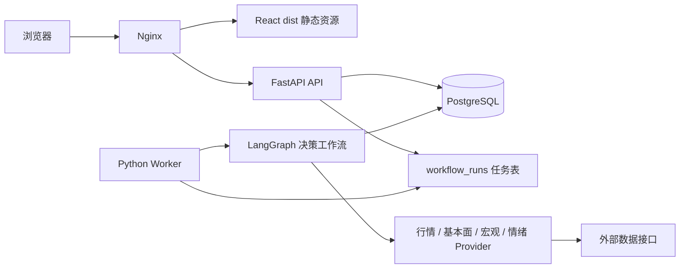

# 投研工作台全栈重构方案：Python 后端与 React 前端

> 日期：2026-07-14  
> 状态：方案草案  
> 适用项目版本：financial_knowledge 0.7.x 之后  
> 文档性质：独立的架构重构方案

## 0. 文档关系与决策摘要

本文专门描述投研工作台的运行时和代码架构重构，**不修改** `.doc/决策模块多角色辩论升级设计与验收清单.md`。

两份文档的职责如下：

- 原决策文档：描述多角色辩论功能、报告内容和业务验收要求。
- 本文档：描述 Python 后端、LangGraph Python、React 前端、数据层、任务层和部署层的目标架构。
- 两份文档发生运行时实现冲突时，以本文档的 Python/React 目标架构为准；原文档中的业务输出、数据诚实性和验收目标继续保留。

本项目尚未上线，重构不需要长期维护旧 Node API 的兼容层。因此，本方案采用一次清晰的目标架构切换，允许在本地迁移阶段短时间并行运行新旧服务，完成切换后删除旧 Node 后端。

### 0.1 最终技术选择

| 层次 | 目标技术 | 职责 |
|---|---|---|
| 前端 | React + TypeScript + Vite | 页面、交互、浏览器端状态和展示 |
| 前端路由 | React Router | 页面路由和 URL 状态 |
| 前端服务端状态 | TanStack Query | API 请求、缓存、加载态、失效刷新 |
| API 服务 | FastAPI | HTTP API、鉴权、OpenAPI、任务创建 |
| 领域模型 | Pydantic | API 输入输出、领域边界和结构化校验 |
| 数据访问 | SQLAlchemy 2 + Alembic | ORM/SQL、事务和数据库迁移 |
| 工作流 | LangGraph Python | 长流程、多 Agent、状态、检查点、恢复 |
| 后台执行 | Python Worker | 执行决策、数据同步、报告生成和定时任务 |
| 数据库 | PostgreSQL | API、Worker、LangGraph 的共享持久化基础 |
| 外部 HTTP | httpx | 行情、基本面、宏观和情绪源接入 |
| 定时任务 | Worker 内置调度或 APScheduler | 低频宏观同步、行情同步和自动化任务 |
| 生产静态文件 | Nginx | 托管 React 构建结果并反向代理 API |

Node.js 保留为前端开发和构建工具。生产环境运行 React 构建后的静态资源，不运行 Node API 服务。

### 0.2 目标运行拓扑



### 0.3 重构成功标准

重构完成后，用户可以在 React 页面中选择持仓或自选标的，创建一条决策运行任务，看到各阶段进度，等待 LangGraph 完成多面证据采集、多角色分析、多空辩论和裁判裁决，并打开带有证据、来源、时间口径、数据缺口和证伪条件的决策报告。

同时，报告、持仓、自选股、信号源、宏观数据、任务和设置等现有功能继续可用，API 与 Worker 可以独立重启，正在运行的决策任务可以恢复或明确失败。

## 1. 当前系统基线

### 1.1 当前运行时

现有项目采用以下结构：

- Preact + `@preact/signals` + Vite 负责前端。
- Node 原生 HTTP 服务负责静态文件、鉴权、API 路由、行情轮询和任务调度。
- `better-sqlite3` 负责单进程 SQLite 存取。
- `lib/` 同时承载 LLM Client、研究 Pipeline、社群信号 Pipeline 和数据解析逻辑。
- Dockerfile 同时构建前端和运行 Node API。
- API 路由以声明式数组注册，但领域模块仍然由 Node 进程直接共享数据库连接。

当前启动方式是 Node API 与 Vite 并行运行；生产容器使用 Node 20 Alpine，监听 4173 端口。

### 1.2 当前数据边界

现有数据库包含以下主要数据：

- `reports`：投研报告元数据。
- `stocks`：自选股。
- `positions`：持仓。
- `market_indices`：市场指数快照。
- `community_signals`：社群信号。
- `decisions`：旧每日决策指南。
- `automation_tasks`：自动化任务。
- `daily_bars`：日线数据。
- `secid_map`：证券代码与行情 secid 映射。
- `settings`、`logs`、`quote_overrides`、`report_asset_links`：配置、日志、手动行情和报告关联。

当前代码中股票、自选股、持仓和证券标识存在重复字段。新后端应在领域层统一证券身份，减少代码、名称、市场和 secid 在多个表之间重复传递。

### 1.3 当前决策模块的实现假设

原决策文档当前假设如下：

- Node 自建 Pipeline。
- 单模型多角色。
- API 请求创建数据库记录后 fire-and-forget。
- 采用 `debates` 表保存进度和最终 JSON。
- 技术、基本面、宏观、情绪四面证据进入辩论。
- 宏观数据暂时使用指数和信号代理。

业务目标继续保留。实现层升级为 LangGraph Python，并把证据快照、工作流事件、数据源口径和任务恢复能力纳入正式设计。

## 2. 重构目标与范围

### 2.1 目标

1. 建立 Python 优先的后端运行时，减少 Agent、数据分析和宏观接入受到的语言生态限制。
2. 使用 FastAPI 建立清晰的 API 边界、鉴权边界和 OpenAPI 契约。
3. 使用 LangGraph Python 实现可持久化、可恢复的决策工作流。
4. 把外部数据源封装为独立 Provider，统一来源、发布时间、观测期、抓取时间和缺失状态。
5. 统一证券身份、持仓、自选股、报告关联和信号关联的数据模型。
6. 使用 React + TypeScript + Vite 建立主流、类型明确、易于维护的前端。
7. API 服务和 Worker 独立部署、独立重启，避免长时间 LLM 任务占用 API 进程。
8. 通过 OpenAPI 自动生成前端 API 类型，减少前后端字段漂移。
9. 保留本地单机部署体验，同时为多个 Worker 和 PostgreSQL 持久化留下空间。

### 2.2 本次重构范围

- 前端 Preact 迁移到 React + TypeScript + Vite。
- Node API 迁移到 FastAPI。
- Node 服务模块迁移到 Python 领域、数据源、仓储和服务模块。
- `better-sqlite3` 访问层迁移到 SQLAlchemy 2。
- SQLite 数据迁移到 PostgreSQL。
- 旧定时任务迁移到 Python Worker。
- LLM Client 迁移为带 Pydantic 校验的 Python Provider。
- 决策 Pipeline 重写为 LangGraph Python。
- 新增宏观数据 Provider 和标准化存储。
- 现有页面迁移为 React 页面，并重建 API 数据加载层。
- Docker Compose 拆分为 Nginx、API、Worker、PostgreSQL 服务。

### 2.3 明确不做

- 不接入券商交易和自动下单。
- 不把系统扩展为多租户 SaaS。
- 不引入 Kafka、Kubernetes 或复杂服务网格。
- 不建设自有大模型训练平台。
- 不把决策报告直接转化为交易指令。
- 不在本轮实现完整的决策准确率回测闭环。
- 不长期维护 Node API 与 Python API 两套生产实现。
- 不为了迁移方便保留最终不会使用的兼容 Wrapper。

## 3. 目标代码结构

### 3.1 仓库结构

```text
financial_knowledge/
├── frontend/
│   ├── src/
│   │   ├── app/
│   │   ├── pages/
│   │   ├── components/
│   │   ├── features/
│   │   ├── api/
│   │   ├── hooks/
│   │   └── styles/
│   ├── package.json
│   ├── tsconfig.json
│   └── vite.config.ts
├── backend/
│   ├── app/
│   │   ├── main.py
│   │   ├── config.py
│   │   ├── api/
│   │   ├── auth/
│   │   ├── domain/
│   │   ├── repositories/
│   │   ├── data_sources/
│   │   ├── workflows/
│   │   ├── tasks/
│   │   ├── llm/
│   │   └── storage/
│   ├── migrations/
│   ├── tests/
│   ├── pyproject.toml
│   └── worker.py
├── infra/
│   ├── nginx/
│   └── docker/
├── scripts/
│   ├── import_sqlite.py
│   └── verify_migration.py
└── .doc/
```

### 3.2 模块依赖规则

依赖方向固定为：

```text
API / Worker
    ↓
Application Services
    ↓
Domain Models + Ports
    ↓
Repositories / Providers / LLM Adapters
    ↓
PostgreSQL / External APIs / Model APIs
```

约束：

- Domain 不导入 FastAPI、SQLAlchemy、httpx 或具体模型 SDK。
- API 路由只负责解析请求、调用 Application Service 和返回响应。
- Provider 只负责采集、解析、标准化和报告数据源状态。
- Workflow 节点不直接拼 SQL，不直接操作 HTTP 请求对象。
- Worker 不绕过 Application Service 修改业务状态。
- 前端不解析后端内部数据库字段，统一消费 OpenAPI 生成的类型。

## 4. 后端目标架构

### 4.1 FastAPI API 层

API 使用 `/api/v1` 作为根路径，按领域注册 Router：

```text
/api/v1/auth
/api/v1/status
/api/v1/reports
/api/v1/instruments
/api/v1/watchlist
/api/v1/positions
/api/v1/signals
/api/v1/market
/api/v1/macro
/api/v1/decision-runs
/api/v1/tasks
/api/v1/settings
/api/v1/exports
```

每个 Router 只包含：

- Pydantic 请求模型。
- Pydantic 响应模型。
- 鉴权依赖。
- Application Service 调用。
- HTTP 状态码和错误映射。

API 不直接执行完整辩论流程。创建决策运行时只创建 `workflow_run`，将任务放入队列，立即返回运行 ID。

### 4.2 领域模型

优先建立以下领域对象：

- `Instrument`：证券身份，包括 code、name、market、security_type、quote_secid。
- `WatchlistItem`：自选关系和研究假设。
- `Position`：持仓数量、成本、持仓理由和风险。
- `Report`：报告元数据和文件资产。
- `CommunitySignal`：情绪和社群信号。
- `MacroSeries`：宏观指标定义。
- `MacroObservation`：宏观指标某个观测期的数值。
- `DecisionRun`：一次标的决策任务。
- `EvidenceSnapshot`：一次决策任务采集到的证据快照。
- `WorkflowEvent`：工作流进度、节点状态和错误。

### 4.3 统一证券身份

目标模型使用 `instruments` 统一证券身份：

```text
instruments
├── id
├── code
├── name
├── market
├── security_type
├── quote_secid
├── source
├── active
├── created_at
└── updated_at
```

业务表通过 `instrument_id` 关联：

```text
watchlist_items  → instruments
positions        → instruments
report_assets    → instruments
signal_assets    → instruments
decision_runs    → instruments
```

这样可以统一处理当前代码中 `301308`、`SZ301308`、`0.301308` 等不同表示，代码和名称只在证券身份层维护。

### 4.4 数据库与迁移

使用 SQLAlchemy 2 管理数据库访问，使用 Alembic 管理迁移。PostgreSQL 作为 API 和 Worker 共享的目标数据库，理由是：

- API 和 Worker 需要并发读写任务状态。
- 任务领取需要事务和行级锁。
- LangGraph 检查点需要稳定的持久化存储。
- 宏观观测、证据快照和工作流事件会持续增长。
- PostgreSQL 的 JSON、索引、事务和迁移能力更适合目标架构。

数据库迁移要求：

- 所有 Schema 变化必须有 Alembic migration。
- 不在应用启动时静默执行破坏性 DDL。
- 每次迁移前生成 SQLite 数据备份。
- 迁移脚本记录导入数量、跳过数量和错误明细。
- `verify_migration.py` 对迁移前后核心表数量、主键和关键字段做校验。
- 报告 HTML 文件和数据库元数据必须分别校验存在性。

## 5. 数据源架构

### 5.1 Provider 接口

所有外部数据源使用 Provider 接口，领域层不感知具体网站或 SDK：

```python
class MarketDataProvider(Protocol):
    async def quote(self, instrument: InstrumentRef) -> QuoteSnapshot: ...
    async def bars(self, instrument: InstrumentRef, period: str) -> list[Bar]: ...

class FundamentalDataProvider(Protocol):
    async def snapshot(self, instrument: InstrumentRef) -> FundamentalSnapshot: ...

class MacroDataProvider(Protocol):
    async def series(self, series_code: str) -> list[MacroObservation]: ...

class SentimentDataProvider(Protocol):
    async def signals(self, instrument: InstrumentRef, window: DateWindow) -> list[Signal]: ...
```

每个返回对象都必须带：

- `source`。
- `source_url`。
- `retrieved_at`。
- `as_of` 或 `observation_period`。
- `release_at`，适用于宏观和基本面数据。
- `freshness`。
- `data_quality`。
- `data_gap` 或 `error`，适用于可降级数据源。

### 5.2 Provider 优先级

第一阶段实现：

1. Eastmoney 行情和基本面 HTTP Provider。
2. 日线和基金净值 Provider。
3. Eastmoney 宏观数据 Provider，覆盖 CPI、GDP、PMI 等指标。
4. 现有 `community_signals` 数据库 Provider。
5. 官方统计数据手动导入 Provider，保存原始来源和发布日期。

第二阶段扩展：

- FRED US 宏观数据。
- IMF、世界银行等国际数据。
- PBoC 利率、流动性和货币数据。
- NBS 官方数据交叉核验。

AKShare 如果接入，只能作为 Provider 的实现细节。业务模块不直接调用 AKShare，避免把不可控的第三方封装扩散到领域层。

### 5.3 宏观数据模型

```text
macro_series
├── id
├── code
├── name
├── region
├── category
├── frequency
├── unit
├── source
├── source_url
├── enabled
└── updated_at

macro_observations
├── id
├── series_id
├── observation_period
├── release_at
├── value
├── unit
├── source
├── source_url
├── retrieved_at
├── revision_hash
└── raw_payload
```

模型提示词只能消费已经标准化的宏观观测，不允许根据模型记忆补齐缺失数值。

## 6. LangGraph 决策工作流

### 6.1 Application Service 接口

API 和 Worker 通过应用服务调用工作流：

```python
class DecisionRunService:
    async def create_run(self, command: CreateDecisionRun) -> DecisionRunCreated: ...
    async def get_run(self, run_id: str) -> DecisionRunView: ...
    async def cancel_run(self, run_id: str) -> None: ...
    async def resume_run(self, run_id: str) -> None: ...
```

LangGraph 的具体节点和 State 只存在于 `workflows/decision/`，不暴露给 API Router。

### 6.2 工作流节点

```text
resolve_target
    ↓
load_market_evidence ───────┐
load_fundamental_evidence ──┤
load_macro_evidence ────────┤ 并行采集
load_sentiment_evidence ────┘
    ↓
validate_evidence
    ↓
technical_analyst ──────────┐
fundamental_analyst ────────┤ 并行分析
macro_analyst ──────────────┤
sentiment_analyst ──────────┘
    ↓
bull_researcher
    ↓
bear_researcher
    ↓
judge
    ↓
risk_reviewer
    ↓
persist_report
```

### 6.3 工作流状态

```python
class DecisionState(TypedDict):
    run_id: str
    target: TargetSnapshot
    evidence: EvidenceBundle
    evidence_gaps: list[DataGap]
    analyst_views: dict[str, AnalystView]
    bull_case: DebateView | None
    bear_case: DebateView | None
    judge_result: JudgeResult | None
    risk_review: RiskReview | None
    events: list[WorkflowEvent]
```

所有模型输出必须经过 Pydantic 校验。解析失败时记录节点错误和数据缺口，按节点策略重试或降级，不把未校验的 JSON 直接写入报告。

### 6.4 失败、重试和恢复

| 类型 | 处理方式 |
|---|---|
| 单个数据源超时 | Provider 返回数据缺口，其他证据继续 |
| 单个分析师失败 | 节点重试；重试失败后保留角色失败信息 |
| 裁判失败 | 整体任务进入可恢复失败，允许重新执行裁判节点 |
| API 进程重启 | Worker 从任务表和 LangGraph 检查点恢复 |
| Worker 进程重启 | 任务保持 running/lease 状态，超时后重新领取 |
| 全部关键证据缺失 | 任务生成“证据不足”结论，不生成确定性操作建议 |
| LLM 未配置 | 任务明确失败，前端显示配置原因 |

每次任务设置：

- 最大执行时长。
- 最大 LLM 调用次数。
- 最大 token 预算。
- 每个节点的超时。
- 幂等键。
- 取消标记。

### 6.5 报告结构

最终报告至少包含：

```text
target
generated_at
evidence_snapshot
analysts
debate
judge
risk_review
data_gaps
source_refs
disclaimer
```

报告中的每个重要结论应能回溯到 `source_refs` 或具体证据快照。报告保留“分析观点”和“事实证据”的边界。

## 7. 工作流任务与进度 API

### 7.1 任务表

```text
workflow_runs
├── id
├── kind
├── status
├── target_instrument_id
├── requested_by
├── idempotency_key
├── current_node
├── progress
├── error_code
├── error_message
├── started_at
├── finished_at
├── created_at
└── updated_at
```

```text
workflow_events
├── id
├── run_id
├── node
├── status
├── progress
├── message
├── payload
└── created_at
```

### 7.2 API

```text
POST /api/v1/decision-runs
GET  /api/v1/decision-runs
GET  /api/v1/decision-runs/{id}
GET  /api/v1/decision-runs/{id}/events
POST /api/v1/decision-runs/{id}/cancel
POST /api/v1/decision-runs/{id}/resume
```

请求只提交业务引用：

```json
{
  "instrument_id": "instrument-id",
  "horizon": "swing",
  "question": "当前持有该标的，是否继续持有？"
}
```

服务端根据 `instrument_id` 解析名称、市场、secid 和当前持仓关系，避免信任前端提交的 code、name 或 quote secid。

进度使用 SSE 推送，详情接口保留用于刷新、断线恢复和历史查询。前端不依赖固定轮询间隔获取工作流状态。

## 8. 前端目标架构

### 8.1 技术选型

- React。
- TypeScript。
- Vite。
- React Router。
- TanStack Query 管理服务端状态。
- 组件和样式先延续当前视觉语言，再按页面逐步整理。
- 图表库在迁移阶段根据现有图表需求选择，不提前引入大型 UI 体系。

React 页面直接使用标准 JSX。最终代码不保留 `@preact/compat` 兼容层，也不保留 Preact signals 作为全局状态方案。

### 8.2 页面边界

```text
AppShell
├── TodayPage
├── KnowledgePage
├── SignalsPage
├── PortfolioPage
├── DecisionsPage
├── TasksPage
└── SettingsPage
```

每个页面只声明自己的 Query 和 Mutation：

- Today：今日报告、市场快照。
- Knowledge：报告列表、搜索和筛选。
- Signals：信号列表、确认和删除。
- Portfolio：自选股、持仓、行情和分析。
- Decisions：决策运行、SSE 进度、报告详情。
- Tasks：任务状态、执行和调度。
- Settings：鉴权状态和运行配置。

### 8.3 前端 API 类型

FastAPI 输出 OpenAPI Schema，前端通过生成命令生成 TypeScript 类型和 API Client。页面使用以下模式：

```text
generated API Client
        ↓
feature query hooks
        ↓
page components
```

页面不直接拼接数据库字段名，不直接处理后端 JSON 字符串，也不自行计算 API 状态。

### 8.4 决策页面交互

1. 从服务端加载持仓和自选标的。
2. 选择标的和研究周期。
3. 创建 `decision_run`。
4. 页面显示排队、取证、分析、辩论、裁决和完成状态。
5. SSE 连接中断时通过详情接口恢复。
6. 完成后展示证据、各角色观点、多空分歧、裁判结论、风险审查和免责声明。
7. 数据缺口、宏观数据代理和来源时间在 UI 中明确展示。

## 9. 鉴权、安全和配置

### 9.1 鉴权

- FastAPI 使用 HttpOnly、Secure、SameSite Cookie。
- 通过 Nginx 使用同源 `/api`，减少跨域配置。
- 修改类请求增加 CSRF 防护。
- 报告文件下载和导出接口统一经过鉴权依赖。
- 外部导入使用独立 Import Token，不复用用户登录 Cookie。

### 9.2 配置

配置通过环境变量或本地 `.env` 注入：

```text
DATABASE_URL
APP_SECRET
AUTH_USERNAME
AUTH_PASSWORD
IMPORT_TOKEN
LLM_API_KEY
LLM_API_URL
LLM_MODEL
MACRO_PROVIDER_CONFIG
```

密钥、个人持仓、数据库和原始数据不提交 Git。

### 9.3 LLM 安全边界

- Provider 对模型请求统一设置超时、重试和 token 上限。
- 模型输出必须通过 Pydantic 校验。
- Prompt 中明确禁止编造缺失数据。
- 原始数据、模型输出和最终报告分层保存。
- 报告始终带有 AI 推演免责声明。

## 10. 部署方案

### 10.1 Docker Compose 服务

```text
frontend-build / nginx
        ↓
api
worker
postgres
```

目标服务职责：

- `nginx`：静态文件、反向代理、响应压缩。
- `api`：FastAPI、鉴权、CRUD、任务创建和 SSE。
- `worker`：LangGraph、数据采集、报告生成和定时任务。
- `postgres`：业务数据、任务状态和工作流检查点。

API 和 Worker 使用同一 Python 包和同一配置模型，入口不同。两者不复制领域逻辑。

### 10.2 本地开发

```bash
# 前端
cd frontend
npm install
npm run dev

# 后端
cd backend
uv sync
uv run fastapi dev app/main.py
uv run python -m app.worker

# 基础设施
docker compose up postgres
```

Vite 开发服务器将 `/api` 代理到 FastAPI；生产环境通过 Nginx 统一为同源访问。

### 10.3 运行时验证

每次部署至少验证：

- API 健康检查。
- 数据库连接。
- Worker 健康状态。
- 鉴权登录和 Cookie。
- 创建一条测试决策任务。
- Worker 能领取任务并写入进度。
- API 重启后任务状态可读。
- Worker 重启后任务可以恢复或进入明确失败。
- 报告文件、数据库记录和来源快照均存在。

## 11. 分阶段实施计划

每个阶段结束后都应有可运行状态。迁移期间允许旧 Node 应用继续作为当前基线运行，但不为旧 API 新增功能。

### 阶段 A：工程基础

- 建立 `frontend/` 和 `backend/` 目录。
- 初始化 React + TypeScript + Vite。
- 初始化 Python 项目、代码格式化、类型检查和测试命令。
- 建立统一配置和环境变量校验。
- 增加 API `/health` 和 Worker 健康检查。

完成标准：React 空壳可启动，FastAPI 可启动，Worker 可启动，PostgreSQL 可连接。

### 阶段 B：数据库和身份模型

- 建立 SQLAlchemy Base、Session 和 Alembic。
- 建立 `instruments`、`watchlist_items`、`positions`。
- 建立 reports、signals、settings 和 logs 的 Python 模型。
- 建立 SQLite 到 PostgreSQL 的导入脚本。
- 执行迁移数量、主键和关联校验。

完成标准：旧数据可导入，核心实体可以通过 API 读取。

### 阶段 C：基础 API

- 实现鉴权、状态、报告、标的、持仓和自选 API。
- 实现信号和导出 API。
- 为所有响应定义 Pydantic Schema。
- 生成 OpenAPI 文件和 TypeScript Client。

完成标准：无需依赖旧 Node API，API 可以完整读取和修改核心业务数据。

### 阶段 D：数据 Provider

- 迁移行情和 K 线采集。
- 迁移基本面快照。
- 迁移基金净值和 secid 解析。
- 迁移情绪信号查询。
- 建立 Provider fixture 和数据源契约测试。

完成标准：选定 A 股、ETF、基金标的可以返回统一快照；数据源失败有结构化缺口。

### 阶段 E：宏观数据

- 建立 `macro_series` 和 `macro_observations`。
- 接入 CPI、GDP、PMI。
- 记录 observation period、release_at、source_url 和 retrieved_at。
- 增加数据刷新任务和重复数据去重。
- 增加官方来源的人工导入入口。

完成标准：宏观面可以返回结构化、可追溯、带发布时间的数据，模型不需要依靠记忆补数。

### 阶段 F：LLM 与 Worker

- 建立 `LLMProvider` 和 OpenAI-compatible Provider。
- 建立结构化 JSON 输出校验。
- 建立 `workflow_runs` 和 `workflow_events`。
- 建立 Worker 任务领取、租约、超时、重试和取消机制。
- 建立 LangGraph 检查点。

完成标准：Worker 可以执行一个虚拟工作流，API 可以查看进度，重启后状态可恢复。

### 阶段 G：决策工作流

- 实现目标解析。
- 实现四面证据采集。
- 实现四个分析师节点。
- 实现多空辩论和裁判。
- 实现风险审查。
- 写入证据快照和最终报告。
- 对照原决策文档验收内容。

完成标准：真实标的可以完成一次端到端决策报告，报告包含分歧、证伪条件、数据缺口、来源和免责声明。

### 阶段 H：React 前端

- 迁移 App Shell、路由、导航和全局错误处理。
- 迁移 Today、Knowledge、Signals、Portfolio、Tasks、Settings。
- 迁移报告阅读和导出。
- 重写 Decisions 页面，接入决策运行和 SSE。
- 移除 Preact signals 和 Preact Router。

完成标准：React 前端覆盖现有功能，并完成一次真实决策任务展示。

### 阶段 I：切换和清理

- 使用 Nginx、API、Worker、PostgreSQL 组成新的 Compose。
- 完成端到端登录、报告、持仓、信号和决策冒烟。
- 删除旧 Node API、旧服务入口和旧 Pipeline 实现。
- 删除无用迁移 Wrapper 和重复数据访问代码。
- 更新 README、部署文档和环境变量示例。

完成标准：生产 Compose 不再启动 Node API，全部核心功能使用 Python API 和 Worker。

## 12. 细粒度提交计划

每个提交只完成一个边界变化，提交后项目应保持可验证状态。

| 编号 | 提交内容 | 验收 |
|---|---|---|
| C01 | 建立 Python 项目、配置、格式化和测试入口 | Python lint/type/test 可运行 |
| C02 | 建立 React + TypeScript + Vite 空壳 | 前端构建通过 |
| C03 | 建立 FastAPI health/config/auth 骨架 | 健康检查和登录测试通过 |
| C04 | 建立 PostgreSQL Compose 与 SQLAlchemy 基础层 | API 可连接数据库 |
| C05 | 建立 Alembic 初始迁移 | 空库可初始化 |
| C06 | 建立 SQLite 导入和迁移校验脚本 | 旧数据导入数量可核对 |
| C07 | 建立 Instrument、Watchlist、Position 领域模型 | 证券身份统一 |
| C08 | 迁移报告、日志、设置和导出 API | 核心 CRUD API 通过测试 |
| C09 | 迁移行情和 K 线 Provider | 真实行情冒烟通过 |
| C10 | 迁移基本面和基金 Provider | 基本面字段及缺口测试通过 |
| C11 | 迁移信号 Provider | 标的过滤和时间窗口测试通过 |
| C12 | 建立宏观数据模型和 CPI/PMI/GDP Provider | 数据带来源和发布时间 |
| C13 | 建立 LLM Provider 和 Pydantic 输出 Schema | mock LLM 测试通过 |
| C14 | 建立 workflow_runs、events 和 Worker 领取机制 | 任务可排队、执行和失败 |
| C15 | 建立 LangGraph 状态和检查点 | 虚拟工作流可恢复 |
| C16 | 实现四面证据采集节点 | 缺源时可降级 |
| C17 | 实现分析师、多空、裁判和风险节点 | mock 决策报告结构完整 |
| C18 | 暴露 decision-runs API 和 SSE | API 可创建、查看、取消、恢复 |
| C19 | 迁移 React Shell 和基础页面 | 页面可通过新 API 读取 |
| C20 | 迁移 Portfolio、Knowledge、Signals、Tasks | 页面行为通过测试 |
| C21 | 重写 Decisions 页面 | 真实任务进度和报告可展示 |
| C22 | 完成 Nginx/API/Worker/PostgreSQL 部署 | Compose 冒烟通过 |
| C23 | 删除旧 Node API 和 Preact 依赖 | 旧后端入口不再被生产使用 |
| C24 | 完成全量回归、文档和部署清理 | 发布前验收通过 |

## 13. 测试决策

### 13.1 Python 后端

- 使用 pytest 测试领域纯函数、Schema 校验和应用服务。
- 使用 fake Provider 测试工作流，不让普通测试访问真实外部接口。
- 使用 fake LLM 测试多 Agent 输出、解析失败、重试和降级。
- 使用 API 集成测试验证 HTTP 状态码、鉴权和响应结构。
- 使用 PostgreSQL 集成测试验证事务、任务领取、唯一键和并发状态。
- Provider 使用保存的真实响应 fixture 测试解析；独立设置 live smoke 命令。
- 迁移脚本使用独立测试数据库验证数量、主键和关联完整性。

### 13.2 React 前端

- 使用 Vitest 测试格式化、URL 状态和数据映射纯函数。
- 使用 React Testing Library 测试页面外部行为、加载态、错误态和完成态。
- 测试 Query 缓存失效和 SSE 连接断开后的恢复。
- 使用浏览器端端到端测试验证登录、选标的、创建决策、查看报告。
- 不测试 React 内部实现细节，不把组件内部 state 结构当作稳定契约。

### 13.3 必须保留的运行时验收

- `npm run build` 或对应前端构建命令通过。
- Python lint、类型检查和 pytest 全部通过。
- Compose 启动后 API、Worker、数据库健康检查通过。
- 未配置 LLM 时创建任务能返回明确失败原因。
- 单个宏观 Provider 失败时，决策任务保留数据缺口并继续。
- API 重启不会丢失已创建任务。
- Worker 重启后任务进入恢复或明确失败状态。
- 报告来源、观测期、发布时间和免责声明完整。

## 14. 风险和应对

| 风险 | 影响 | 应对 |
|---|---|---|
| 外部接口字段变更 | 数据采集失败 | Provider 契约测试、原始响应 fixture、数据缺口降级 |
| 宏观数据修订 | 历史报告口径变化 | 保存 revision_hash、release_at 和原始 payload |
| LLM 输出不稳定 | 报告结构不完整 | Pydantic 校验、重试、节点级失败状态 |
| 多 Agent 调用成本过高 | 单次任务成本和延迟增加 | token 预算、调用上限、模型分层和缓存 |
| Worker 重复领取任务 | 重复报告或重复采集 | 租约、幂等键、数据库行锁 |
| PostgreSQL 部署复杂度增加 | 本地启动变重 | Compose 默认启动，提供一键初始化和备份脚本 |
| React 迁移后交互回归 | 页面体验下降 | 页面逐个迁移，保留截图/端到端验收 |
| 新旧数据模型映射错误 | 持仓和报告关联错误 | 导入报告、数量校验和抽样人工核对 |

## 15. 关键架构决策记录

### ADR-001：后端采用 Python

决策：后端统一使用 Python。

理由：LangGraph Python、宏观数据处理、pandas/numpy、统计分析和后续量化研究都属于项目核心方向。项目尚未上线，适合直接建立长期运行时。

### ADR-002：前端采用 React + TypeScript + Vite

决策：前端从 Preact 迁移到 React + TypeScript + Vite。

理由：React 生态、组件资源、资料和协作范围更广；TypeScript 与 FastAPI OpenAPI 结合后，可以形成明确的前后端契约。Vite 保留为开发服务器和构建工具。

### ADR-003：API 和 Worker 分进程

决策：FastAPI API 与 Python Worker 分开运行。

理由：LLM 和数据采集任务具有长耗时、可重试、可恢复特性，不能占用 API 请求进程。两者共享领域包和数据库，不复制业务逻辑。

### ADR-004：使用 PostgreSQL 作为目标数据库

决策：PostgreSQL 作为目标环境的标准数据库。

理由：任务并发、工作流检查点、行级锁、迁移和 JSON 数据查询都需要稳定的多进程数据库能力。当前 SQLite 数据通过一次性脚本导入，完成后不再维护双数据库写入路径。

### ADR-005：SSE 作为工作流进度通道

决策：使用 SSE 推送任务进度，详情接口用于刷新和断线恢复。

理由：决策工作流主要是服务端向前端单向推送阶段状态，SSE 的复杂度和浏览器支持适合当前场景；WebSocket 留给未来需要双向实时交互的功能。

### ADR-006：Provider 隔离外部数据源

决策：所有行情、基本面、宏观和情绪接入都通过 Provider。

理由：外部接口字段和稳定性会变化，Provider 可以集中处理解析、重试、口径、来源和降级，避免数据源细节进入业务和 Agent 节点。

## 16. 参考资料

- [React 官方文档](https://react.dev/)
- [Vite 官方文档](https://vite.dev/guide/)
- [LangGraph Python 官方文档](https://docs.langchain.com/oss/python/langgraph/overview)
- [LangGraph Python Graph API](https://docs.langchain.com/oss/python/langgraph/graph-api)
- 原业务方案：`.doc/决策模块多角色辩论升级设计与验收清单.md`

