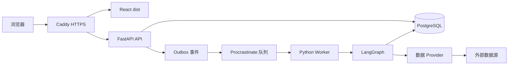

# 投研工作台全栈重构技术方案：Review 落实版

> 日期：2026-07-14  
> 状态：Review 修订版，作为实施前的技术基线  
> 目标形态：小范围可信多用户（<10 人）+ BYOK + 邀请码注册  
> 适用版本：financial_knowledge 0.7.x → 1.0

## 0. 文档关系与结论

本文档是对以下方案的独立修订落实，不修改原文：

- `.doc/投研工作台全栈重构技术方案.md`：Claude 版本，保留为原始方案记录。
- `.doc/全栈重构方案-Python后端与React前端.md`：初版 Python/React 架构草案。
- `.doc/决策模块多角色辩论升级设计与验收清单.md`：决策模块业务契约。

本文档把 review 意见落实为具体的：

- 架构决策；
- Module、Interface、Seam 和 Adapter；
- 数据表和约束；
- 用户、资源和密钥的权限规则；
- 任务队列与 LangGraph 状态关系；
- 迁移步骤和真实数据基线；
- API 契约；
- 测试和运行时验收。

### 0.1 最终结论

整体技术方向保留：

```text
React + TypeScript + Vite
        ↓
Caddy（TLS、前端静态资源、反向代理）
        ↓
FastAPI API
        ↓
PostgreSQL
        ↑
Python Worker + Procrastinate + LangGraph Python
```

实施前必须完成本文件中的 P0 决策。尤其要先解决：

1. 共享报告与用户个人状态的模型冲突。
2. `stocks.code` 主键无法支持多用户的问题。
3. BYOK 对所有 LLM 任务的归属和密钥轮换。
4. Cookie Session、CSRF、邀请码和速率限制。
5. Procrastinate、手写队列和 APScheduler 的职责重叠。
6. LangGraph Checkpoint 与业务状态的关系。
7. SQLite/WAL/报告文件的真实迁移基线。
8. 旧 API 数量和数据语义与“26 个端点 1:1 迁移”之间的不一致。

## 1. Review 问题闭环表

| 编号 | Review 问题 | 修订决策 | 优先级 | 验收位置 |
|---|---|---|---|---|
| R1 | 报告公共共享，但阅读/标星/归档字段当前是共享字段 | `reports` 内容与 `user_report_states` 分离；报告默认私有，发布后共享 | P0 | §4.3、§7.4、§12.1 |
| R2 | `stocks.code` 当前是主键，无法支持不同用户添加同一证券 | 提前建立 `instruments` 和 `watchlist_items`；自选关系使用 UUID 主键 | P0 | §4.1、§4.2 |
| R3 | BYOK 只描述辩论，未覆盖报告、信号、持仓分析和系统任务 | 引入 `LlmExecutionContext`；所有 LLM 调用明确执行用户 | P0 | §6.1、§6.2 |
| R4 | APP_SECRET 同时承担 Session 和 BYOK 加密 | 拆分 `SESSION_SECRET`、`BYOK_MASTER_KEY`、`LANGGRAPH_AES_KEY` | P0 | §6.3 |
| R5 | 用户可配置任意 LLM URL，存在 SSRF 风险 | HTTPS、主机/IP 校验、重定向限制和可配置 allowlist | P0 | §6.4 |
| R6 | Cookie 认证缺少撤销、CSRF、登录/注册防滥用 | 数据库 Session、CSRF、速率限制、Session 撤销 | P0 | §5 |
| R7 | Procrastinate、手写 SKIP LOCKED、lease_until 同时存在 | Procrastinate 作为唯一队列；`debates` 只保存业务状态 | P0 | §8 |
| R8 | `PostgresSaver.setup()` 与 Alembic 的职责未定 | 业务 Schema 由 Alembic 管理；队列和 Checkpoint 使用各自初始化流程 | P0 | §8.4、§9.2 |
| R9 | 迁移基线固定数量过时，当前存在 WAL 和报告文件不一致 | 迁移前动态生成快照；报告缺失/孤儿文件进入清单和隔离区 | P0 | §9 |
| R10 | 当前不是 26 个路由声明，旧 API 不能整体冻结 | 旧 API 作为迁移清单；新 `/api/v1` 以领域契约重新设计 | P0 | §7 |
| R11 | Caddy 与 FastAPI 都承担静态文件职责 | Caddy 独占前端静态文件；FastAPI 只提供 API 和受保护报告文件 | P1 | §10 |
| R12 | 时间字段继续保留 TEXT 会把 SQLite 问题带入 PostgreSQL | 新模型统一使用 `timestamptz`、`date` 和明确的周期字段 | P1 | §4.5 |
| R13 | `passlib[bcrypt]` 不是新用户密码的首选 | 新密码使用 `pwdlib[argon2]`，仅为旧哈希保留兼容读取 | P1 | §5.2 |
| R14 | 当前调度器由 API 进程持有，未来扩容会重复执行 | Procrastinate 周期任务由 Worker 持有；API 只改配置和查看状态 | P1 | §8.5 |

## 2. 目标架构与 Module 纪律

### 2.1 运行拓扑



### 2.2 服务职责

| Module | Interface | Implementation |
|---|---|---|
| Caddy | HTTPS、静态资源、`/api/*` 反向代理 | Caddyfile + 前端资源镜像 |
| FastAPI API | 用户请求、鉴权、授权、CRUD、创建任务、查询状态 | FastAPI Router + Application Service |
| Worker | 领取队列任务、执行数据同步和工作流 | Procrastinate Worker + Python Application Service |
| PostgreSQL | 业务数据、Outbox、Procrastinate Schema、LangGraph Checkpoint | PostgreSQL 16+ |
| Provider Module | 采集、解析、标准化、来源元数据和数据缺口 | Eastmoney、AKShare、官方导入、飞书 Adapter |
| LLM Module | 按执行身份构造模型客户端、超时、重试、输出校验 | `langchain-openai` Adapter |
| Decision Workflow Module | 创建、恢复、取消和完成一次决策运行 | LangGraph Python |

### 2.3 依赖方向

```text
Router
  ↓
Application Service
  ↓
Domain Module / Workflow Module
  ↓
Repository Interface / Provider Interface / LLM Interface
  ↓
PostgreSQL Adapter / External HTTP Adapter / LLM Adapter
```

约束：

- Router 不直接写数据库。
- Workflow Node 不持有 FastAPI `Request`，不拼 SQL。
- Provider 不生成业务结论。
- LLM Adapter 不读取环境里的全局业务 Key。
- 授权校验在 Application Service 的 Interface 上完成，不能只依赖前端隐藏按钮。
- 每个 Adapter 都通过 Interface 测试；普通测试使用 fake Adapter，不访问真实外部服务。
- 删除旧 Node 后，复杂度必须集中在 Python Module 内部，不能扩散为前端、Router、Worker 各自复制一套逻辑。

## 3. 目录结构

```text
financial_knowledge/
├── frontend/
│   ├── src/
│   │   ├── app/
│   │   ├── pages/
│   │   ├── features/
│   │   ├── components/
│   │   ├── api/
│   │   ├── hooks/
│   │   └── styles/
│   ├── package.json
│   ├── tsconfig.json
│   └── vite.config.ts
├── backend/
│   ├── app/
│   │   ├── main.py
│   │   ├── worker.py
│   │   ├── config.py
│   │   ├── api/
│   │   ├── auth/
│   │   ├── domain/
│   │   ├── application/
│   │   ├── repositories/
│   │   ├── providers/
│   │   ├── llm/
│   │   ├── workflows/
│   │   └── queue/
│   ├── alembic/
│   ├── tests/
│   ├── scripts/
│   └── pyproject.toml
├── infra/
│   ├── caddy/Caddyfile
│   └── docker/
├── scripts/
├── data/
└── .doc/
```

## 4. 多用户数据模型

### 4.1 证券身份提前建立

证券身份在 M1 建立，不再推迟到闭环完成后。理由是 `stocks.code` 当前是主键，新增 `owner_id` 无法解决多用户同一证券的问题。

```text
instruments
├── id UUID PRIMARY KEY
├── code TEXT NOT NULL
├── name TEXT NOT NULL
├── market TEXT NOT NULL
├── security_type TEXT NOT NULL
├── quote_secid TEXT
├── source TEXT
├── active BOOLEAN NOT NULL DEFAULT TRUE
├── created_at TIMESTAMPTZ NOT NULL
└── updated_at TIMESTAMPTZ NOT NULL

UNIQUE(market, code)
```

证券身份负责解决：

- `301308`、`SZ301308`、`0.301308` 的规范化；
- 股票、ETF、基金、港股、美股的证券类型；
- 行情 Provider 所需的 `quote_secid`；
- 报告、信号和决策使用同一个证券引用。

### 4.2 自选与持仓

```text
watchlist_items
├── id UUID PRIMARY KEY
├── owner_id UUID NOT NULL REFERENCES users(id)
├── instrument_id UUID NOT NULL REFERENCES instruments(id)
├── status TEXT NOT NULL DEFAULT '观察'
├── thesis TEXT
├── advice TEXT
├── risk TEXT
├── watch_signals JSONB NOT NULL DEFAULT '[]'
├── sparkline JSONB NOT NULL DEFAULT '[]'
├── analysis_status TEXT NOT NULL DEFAULT 'pending'
├── created_at TIMESTAMPTZ NOT NULL
└── updated_at TIMESTAMPTZ NOT NULL

UNIQUE(owner_id, instrument_id)
```

```text
positions
├── id UUID PRIMARY KEY
├── owner_id UUID NOT NULL REFERENCES users(id)
├── instrument_id UUID NOT NULL REFERENCES instruments(id)
├── shares NUMERIC NOT NULL DEFAULT 0
├── cost NUMERIC NOT NULL DEFAULT 0
├── reason TEXT
├── risk TEXT
├── analysis_status TEXT NOT NULL DEFAULT 'pending'
├── created_at TIMESTAMPTZ NOT NULL
└── updated_at TIMESTAMPTZ NOT NULL
```

持仓允许同一用户对同一证券存在多笔记录时，使用业务约束显式决定是否合并；不能依赖代码字符串和时间戳隐式区分。

### 4.3 用户、Session 和邀请码

```text
users
├── id UUID PRIMARY KEY
├── username TEXT UNIQUE NOT NULL
├── password_hash TEXT NOT NULL
├── role TEXT NOT NULL CHECK (role IN ('superadmin', 'member'))
├── status TEXT NOT NULL CHECK (status IN ('active', 'disabled'))
├── created_at TIMESTAMPTZ NOT NULL
└── updated_at TIMESTAMPTZ NOT NULL
```

```text
sessions
├── id UUID PRIMARY KEY
├── user_id UUID NOT NULL REFERENCES users(id)
├── token_hash TEXT UNIQUE NOT NULL
├── expires_at TIMESTAMPTZ NOT NULL
├── revoked_at TIMESTAMPTZ
├── last_seen_at TIMESTAMPTZ
└── created_at TIMESTAMPTZ NOT NULL
```

Cookie 只保存随机 Session Token，不保存角色和 BYOK 配置。数据库保存 Token 的 HMAC 摘要。每次请求通过 Session 查用户状态和角色，支持：

- 禁用用户立即失效；
- 修改密码时撤销全部 Session；
- 单设备退出；
- 超管撤销指定 Session；
- 不把角色信任放在 Cookie payload 中。

```text
invite_codes
├── id UUID PRIMARY KEY
├── code_hash TEXT UNIQUE NOT NULL
├── code_hint TEXT NOT NULL
├── created_by UUID NOT NULL REFERENCES users(id)
├── expires_at TIMESTAMPTZ NOT NULL
├── used_by UUID REFERENCES users(id)
├── used_at TIMESTAMPTZ
├── revoked_at TIMESTAMPTZ
└── created_at TIMESTAMPTZ NOT NULL
```

邀请码只在生成成功时展示一次。注册使用原子更新：

```sql
UPDATE invite_codes
SET used_by = :user_id, used_at = now()
WHERE code_hash = :code_hash
  AND used_at IS NULL
  AND revoked_at IS NULL
  AND expires_at > now();
```

受影响行数必须为 1，随后在同一个事务中创建用户；否则注册失败。

### 4.4 报告、共享和个人阅读状态

```text
reports
├── id TEXT PRIMARY KEY
├── owner_id UUID REFERENCES users(id)
├── visibility TEXT NOT NULL CHECK (visibility IN ('private', 'shared'))
├── title TEXT NOT NULL
├── topic TEXT NOT NULL
├── type TEXT NOT NULL
├── summary TEXT
├── tags JSONB NOT NULL DEFAULT '[]'
├── source TEXT
├── origin TEXT
├── file TEXT NOT NULL
├── created_at TIMESTAMPTZ NOT NULL
└── updated_at TIMESTAMPTZ NOT NULL
```

```text
user_report_states
├── user_id UUID NOT NULL REFERENCES users(id)
├── report_id TEXT NOT NULL REFERENCES reports(id)
├── read_at TIMESTAMPTZ
├── starred BOOLEAN NOT NULL DEFAULT FALSE
├── archived BOOLEAN NOT NULL DEFAULT FALSE
└── updated_at TIMESTAMPTZ NOT NULL

PRIMARY KEY(user_id, report_id)
```

规则：

- 用户手动研究报告默认 `private`，owner 为创建者。
- 系统公共行情/宏观简报由超管或系统身份生成，默认 `shared`。
- 成员不能把自己的报告直接发布为共享，发布操作需要超管审核或明确的发布权限。
- 共享报告的阅读、标星、归档属于用户状态，不能回写 `reports` 主表。
- 报告 HTML 文件只能通过受保护的报告内容接口读取，Caddy 不直接暴露 `data/reports/`。
- `report_asset_links` 继承报告可见性；私人报告的资产关联不能出现在公共资产页面。

### 4.5 公共信号、日志和任务

```text
community_signals
├── id TEXT PRIMARY KEY
├── visibility TEXT NOT NULL DEFAULT 'shared'
├── source TEXT NOT NULL
├── source_url TEXT
├── related_assets JSONB NOT NULL DEFAULT '[]'
├── metadata JSONB NOT NULL DEFAULT '{}'
└── ...
```

如果页面需要“确认/忽略”，使用用户状态表：

```text
user_signal_states
├── user_id UUID NOT NULL REFERENCES users(id)
├── signal_id TEXT NOT NULL REFERENCES community_signals(id)
├── state TEXT NOT NULL CHECK (state IN ('unread', 'confirmed', 'ignored'))
└── updated_at TIMESTAMPTZ NOT NULL

PRIMARY KEY(user_id, signal_id)
```

公共信号的删除和修订只允许超管或系统同步任务执行。

```text
audit_events
├── id UUID PRIMARY KEY
├── actor_user_id UUID REFERENCES users(id)
├── action TEXT NOT NULL
├── resource_type TEXT
├── resource_id TEXT
├── ip_hash TEXT
├── metadata JSONB NOT NULL DEFAULT '{}'
└── created_at TIMESTAMPTZ NOT NULL
```

系统运行日志与审计事件不通过普通成员的业务列表接口暴露。用户可以看到与自己任务相关的错误摘要，不能读取全局日志。

```text
automation_tasks
├── id UUID PRIMARY KEY
├── scope TEXT NOT NULL CHECK (scope IN ('system', 'user'))
├── owner_id UUID REFERENCES users(id)
├── execution_owner_id UUID REFERENCES users(id)
├── executor TEXT NOT NULL
├── enabled BOOLEAN NOT NULL DEFAULT FALSE
├── schedule TEXT
├── config JSONB NOT NULL DEFAULT '{}'
└── ...
```

规则：

- 系统任务 `scope=system`、`owner_id=NULL`，一期只允许超管配置。
- 系统任务的 LLM 执行身份使用 `execution_owner_id` 指向超管；超管未配置 Key 时，该 LLM 步骤明确失败。
- 用户任务 `scope=user` 必须有 owner，只能读写自己的任务。
- 成员一期不能创建会写入公共数据的自动化任务。

### 4.6 时间和 JSON 类型

新 PostgreSQL Schema 不使用业务时间字符串：

| 语义 | 类型 |
|---|---|
| 创建、更新、发布时间、抓取时间 | `TIMESTAMPTZ` |
| 本地自然日 | `DATE` |
| 宏观所属周期 | `observation_period` + `period_label` |
| 金额、数量、成本 | `NUMERIC` |
| 可查询 JSON | `JSONB` |
| 原始响应 | `JSONB` 或对象存储引用 |

迁移脚本对旧 ISO 字符串解析失败时必须报告并停止，不能静默写入 NULL。

## 5. 鉴权与授权

### 5.1 密码

- 新用户使用 `pwdlib[argon2]`。
- `passlib` 仅用于读取未来可能存在的旧 bcrypt 哈希，不作为新密码生成器。
- 登录时对不存在的用户也执行一次 dummy hash 校验，减少用户名枚举的时间差。
- 密码最小长度、最大长度和常见弱密码规则由 Pydantic Schema 校验。

### 5.2 Session

登录成功：

1. 校验用户名和 Argon2 密码哈希。
2. 生成高熵随机 Session Token。
3. 数据库保存 Token HMAC 摘要。
4. 浏览器保存 `HttpOnly; Secure; SameSite=Lax` Cookie。
5. 响应只返回用户展示信息，不返回 Token。

请求鉴权：

1. 从 Cookie 读取 Token。
2. 计算 HMAC 摘要查 `sessions`。
3. 校验过期、撤销和用户状态。
4. 从数据库加载最新角色，不信任 Cookie 中的 role。
5. 注入 `CurrentUser` 到 Application Service。

### 5.3 CSRF

Cookie 鉴权的所有写请求都需要：

- `Origin` 必须匹配允许的前端 Origin；
- `Content-Type: application/json`；
- `X-CSRF-Token` 与非 HttpOnly CSRF Cookie 一致；
- Caddy 和 FastAPI 不允许任意跨域带凭证请求。

登录、注册和导入端点分别定义匿名请求的 CSRF 规则，不能把所有匿名端点统一放宽。

### 5.4 速率限制

一期使用 PostgreSQL 固定窗口表，不引入 Redis：

```text
rate_limit_buckets
├── key_hash
├── action
├── window_start
├── count
└── expires_at
```

至少限制：

- 登录：按 IP 和用户名；
- 注册：按 IP 和邀请码 hash；
- 邀请码校验：按 IP；
- BYOK 测试连接：按用户；
- 创建辩论：按用户和时间窗口。

### 5.5 授权

隔离资源统一使用 `ResourceAccess` Module：

```python
resource_access.require_owner(resource, current_user)
resource_access.require_shared_or_owner(resource, current_user)
resource_access.require_superadmin(current_user)
```

Interface 约束：

- 无权访问统一返回 404，避免泄露资源存在性。
- 列表在 Repository 查询层加入 owner 条件，不在 Python 列表返回后过滤。
- 超管也不能读取成员的私人持仓、私人报告和私人辩论。
- 超管可以管理用户、邀请码和系统任务，但不自动获得成员业务数据权限。

## 6. BYOK 全链路设计

### 6.1 LLM 执行身份

所有需要 LLM 的 Application Service 都必须接收 `LlmExecutionContext`：

```python
class LlmExecutionContext:
    execution_owner_id: UUID
    request_actor_id: UUID | None
    purpose: Literal[
        "research",
        "stock_analysis",
        "position_analysis",
        "signal_extraction",
        "debate",
        "scheduled_briefing",
    ]
    run_id: str
```

执行规则：

| 任务 | `execution_owner_id` |
|---|---|
| 用户手动研究 | 当前用户 |
| 用户分析自选/持仓 | 当前用户 |
| 用户发起辩论 | 当前用户 |
| 系统每日任务 | 超管账号 |
| 系统信号抽取 | 超管账号 |
| 超管手动同步公共数据 | 超管账号 |

没有执行身份或执行身份未配置 Key 时，任务进入明确的 `llm_unavailable` 状态。系统不会隐式回退到全局环境 Key。

### 6.2 BYOK 配置表和 Interface

```text
user_llm_configs
├── user_id UUID PRIMARY KEY REFERENCES users(id)
├── api_key_ciphertext TEXT NOT NULL
├── api_url TEXT NOT NULL
├── model TEXT NOT NULL
├── key_version INTEGER NOT NULL
├── updated_at TIMESTAMPTZ NOT NULL
```

Interface：

```text
GET    /api/v1/me/llm
PUT    /api/v1/me/llm
DELETE /api/v1/me/llm
POST   /api/v1/me/llm/test
```

返回值只包含：

```json
{
  "configured": true,
  "providerHost": "openrouter.ai",
  "model": "masked-model",
  "keyHint": "sk-****abcd",
  "updatedAt": "2026-07-14T00:00:00Z"
}
```

绝不返回明文 Key、密文、完整 URL 中的敏感查询参数或请求头。

### 6.3 密钥分离与轮换

环境变量分离：

```text
SESSION_LOOKUP_SECRET
BYOK_MASTER_KEY
LANGGRAPH_AES_KEY
```

- `SESSION_LOOKUP_SECRET`：Session Token HMAC。
- `BYOK_MASTER_KEY`：Fernet 加密用户 LLM Key。
- `LANGGRAPH_AES_KEY`：LangGraph Checkpoint 加密。

BYOK 主密钥轮换流程：

1. 配置新主密钥和 `new_key_version`。
2. 后台执行 rewrap：用旧版本解密，用新版本加密。
3. 校验全部用户配置可解密。
4. 标记旧版本只读保留窗口。
5. 删除旧密钥前生成离线备份并完成人工确认。

丢失 `BYOK_MASTER_KEY` 时，数据库中的用户 Key 不可恢复。部署文档必须写明备份责任。

### 6.4 LLM URL 安全

`api_url` 通过 `LlmEndpointPolicy` 校验：

- scheme 只允许 `https`；开发环境允许显式配置的 `http://localhost`；
- 禁止回环、私有、链路本地和云元数据 IP；
- DNS 解析后的 IP 重新校验；
- 禁止跨主机重定向；
- 默认 allowlist：OpenAI、OpenRouter、DeepSeek 等明确 Provider；
- 自定义 Provider 必须由超管在系统配置中允许域名；
- 请求超时、响应体大小和最大重试次数固定；
- 日志只记录 host、status、latency，不记录 Authorization。

## 7. `/api/v1` 新 API 契约

旧 `api-routes.js` 是迁移清单，不作为“26 个端点 1:1 冻结契约”。当前路由表实际包含约 50 个 `method` 声明，且不少查询直接读取全局数据。[server/api-routes.js](/Users/wanghaojian/work/financial_knowledge/server/api-routes.js:26)

### 7.1 认证和用户

```text
GET  /api/v1/auth/session
POST /api/v1/auth/login
POST /api/v1/auth/logout
POST /api/v1/auth/register
GET  /api/v1/me
GET  /api/v1/me/llm
PUT  /api/v1/me/llm
DELETE /api/v1/me/llm
POST /api/v1/me/llm/test
```

### 7.2 超管

```text
POST /api/v1/invites
GET  /api/v1/invites
POST /api/v1/invites/{id}/revoke
GET  /api/v1/users
POST /api/v1/users/{id}/disable
POST /api/v1/users/{id}/enable
POST /api/v1/users/{id}/revoke-sessions
```

### 7.3 用户隔离资源

```text
GET    /api/v1/watchlist
POST   /api/v1/watchlist
DELETE /api/v1/watchlist/{id}
POST   /api/v1/watchlist/{id}/analyze

GET    /api/v1/positions
POST   /api/v1/positions
PATCH  /api/v1/positions/{id}
DELETE /api/v1/positions/{id}
POST   /api/v1/positions/{id}/analyze

GET    /api/v1/decision-runs
POST   /api/v1/decision-runs
GET    /api/v1/decision-runs/{id}
POST   /api/v1/decision-runs/{id}/cancel
POST   /api/v1/decision-runs/{id}/resume
```

### 7.4 共享报告和个人状态

```text
GET  /api/v1/reports
GET  /api/v1/reports/{id}
POST /api/v1/reports/{id}/read
POST /api/v1/reports/{id}/star
POST /api/v1/reports/{id}/archive
GET  /api/v1/reports/{id}/content
POST /api/v1/reports/{id}/publish
```

`GET /reports` 的查询逻辑：

```text
visibility = shared OR owner_id = current_user.id
```

阅读、标星和归档只写 `user_report_states`。`publish` 仅超管可调用，或未来增加明确的内容审核权限。

### 7.5 公共数据和任务

```text
GET  /api/v1/instruments/search
GET  /api/v1/market/snapshot
GET  /api/v1/market/indices
GET  /api/v1/macro/series
GET  /api/v1/macro/observations
GET  /api/v1/signals
POST /api/v1/signals/{id}/state

GET  /api/v1/tasks
POST /api/v1/tasks/{id}/run
PATCH /api/v1/tasks/{id}
GET  /api/v1/audit-events
```

`audit-events` 只允许超管访问。成员不读取系统日志。

## 8. 工作流、队列与 Checkpoint

### 8.1 三层状态分工

```text
Procrastinate Job
  = 是否排队、领取、重试、取消

debates
  = 用户可见的业务任务、阶段、报告和错误摘要

LangGraph Checkpoint
  = 图的中间 State、节点恢复和工作流历史
```

三者不能互相替代，也不能各自实现一套领取逻辑。

### 8.2 `debates` 表

```text
debates
├── id UUID PRIMARY KEY
├── owner_id UUID NOT NULL REFERENCES users(id)
├── execution_owner_id UUID NOT NULL REFERENCES users(id)
├── instrument_id UUID NOT NULL REFERENCES instruments(id)
├── queue_job_id TEXT UNIQUE
├── graph_thread_id TEXT UNIQUE NOT NULL
├── status TEXT NOT NULL CHECK (status IN ('queued','running','done','failed','canceled'))
├── progress INTEGER NOT NULL DEFAULT 0
├── stage TEXT
├── report JSONB
├── error_code TEXT
├── error_message TEXT
├── attempt INTEGER NOT NULL DEFAULT 0
├── created_at TIMESTAMPTZ NOT NULL
├── started_at TIMESTAMPTZ
├── finished_at TIMESTAMPTZ
└── updated_at TIMESTAMPTZ NOT NULL
```

`graph_thread_id` 由服务端生成，例如：

```text
decision:{owner_id}:{debate_id}
```

前端永远不提交或直接使用内部 Thread ID。

### 8.3 Outbox 防止“业务记录已创建但任务未入队”

API 创建辩论时，在一个数据库事务中写入：

```text
debates(status='queued')
outbox_events(type='debate.created', aggregate_id=debate_id)
```

Outbox Dispatcher 负责把事件提交给 Procrastinate。成功后回填 `queue_job_id`，失败则按退避策略重试。

这样可以覆盖 API 在“数据库提交成功、队列提交失败”之间崩溃的情况。

### 8.4 Procrastinate 使用规则

- Procrastinate 是唯一任务队列。
- 业务代码不手写 `SELECT ... FOR UPDATE SKIP LOCKED`。
- 业务代码不自行实现 `lease_until`。
- 使用任务锁或 queueing lock 保证同一 `debate_id` 不重复排队。
- 任务函数必须幂等：重复执行只允许更新同一 `debate_id`，不能重复创建报告。
- Procrastinate 表放在独立 PostgreSQL Schema，例如 `queue`。
- Procrastinate 自带 SQL migration 单独执行，不纳入业务 Alembic migration。
- 依赖版本精确锁定，并写一个 Worker 启动/重试集成测试。

### 8.5 LangGraph Checkpoint 使用规则

- 使用 `langgraph-checkpoint-postgres` 的 `PostgresSaver`。
- Checkpoint 放在独立 Schema，例如 `langgraph`。
- 部署使用一次性 `init-checkpoints` 命令执行官方 setup。
- 业务 Alembic 只管理业务表和 Outbox，不接管第三方内部表。
- 使用 LangGraph 加密 Serializer，密钥来自 `LANGGRAPH_AES_KEY`。
- Checkpoint State 不保存 BYOK 明文，不保存完整 Authorization Header。
- Checkpoint 元数据包含 `owner_id` 和 `debate_id`，但授权仍由 Application Service 执行。

### 8.6 调度

Procrastinate 负责周期任务的触发；API 不启动 APScheduler。

系统任务：

```text
periodic task → Procrastinate queue → Worker
```

任务执行身份由 `automation_tasks.execution_owner_id` 指定。多个 Worker 并行时，Procrastinate 负责队列锁；同一个周期任务使用稳定的幂等键。

## 9. SQLite 数据迁移与真实基线

### 9.1 当前实际数据快照

2026-07-14 在当前工作区读取到：

| 数据 | 当前实际值 |
|---|---:|
| `daily_bars` | 50307 |
| `logs` | 179 |
| `community_signals` | 103 |
| `reports` | 32 |
| `positions` | 14 |
| `stocks` | 9 |
| `market_indices` | 7 |
| `settings` | 13 |
| `decisions` | 10 |
| `automation_tasks` | 1 |
| `quote_overrides` | 0 |
| `report_asset_links` | 0 |
| `secid_map` | 14 |
| HTML 文件 | 63 |
| `app.db-wal` | 约 4.7 MB |

当前数据与原 Claude 方案的 50296/98/31/173/62 基线已经发生变化。迁移验收不能写死这些历史数量。

### 9.2 当前报告文件不一致

当前检查结果：

```text
数据库引用但文件缺失：5 个
存在 HTML 但数据库无记录：36 个
```

迁移工具必须输出机器可读的 reconciliation report：

```json
{
  "missing_db_refs": [],
  "orphan_files": [],
  "invalid_json_rows": [],
  "invalid_timestamps": []
}
```

迁移不会自动删除：

- 数据库引用但缺失的报告保留数据库行，标记 `content_status='missing'`；
- 孤儿 HTML 复制到 `data/reports/_orphaned/<migration_id>/`；
- 由人工决定是否重新导入或清理。

### 9.3 安全快照顺序

迁移前：

1. 停止 Node 服务和所有 SQLite 写入脚本。
2. 使用 SQLite `.backup` 生成冷快照，确保 WAL 内容被纳入。
3. 对冷快照执行 `PRAGMA integrity_check`。
4. 记录快照路径、SQLite page count、WAL 状态和 SHA-256。
5. 再对原库执行 `PRAGMA wal_checkpoint(TRUNCATE)`。
6. 只从经过校验的冷快照导入 PostgreSQL。

不能只复制 `app.db` 文件后忽略同目录的 `app.db-wal` 和 `app.db-shm`。

### 9.4 导入顺序

```text
1. 创建 PostgreSQL database/schema
2. Alembic 创建 users 和基础业务表
3. 创建超管账号
4. 导入 instruments 并生成 code/market/secid 映射
5. 导入公共数据
6. 导入报告并建立 private/shared 可见性
7. 导入自选和持仓，owner_id 指向超管
8. 导入历史 decisions，默认 private + owner=超管
9. 导入设置和系统任务
10. 生成报告文件 reconciliation report
11. 全量验证
```

### 9.5 迁移验收

- 每张旧表都有动态行数快照；
- 每个主键集合完成比对；
- JSON 字段 100% 解析，失败即停止；
- 时间字段 100% 转换为目标类型；
- 自选和持仓都能解析到 `instrument_id`；
- 同一证券被多个用户使用时不发生主键冲突；
- 存量隔离数据全部属于超管；
- 报告缺失和孤儿文件全部进入 reconciliation report；
- 迁移脚本重复执行不会重复导入；
- 不允许业务启动时隐式运行全量导入。

## 10. 数据 Provider 和宏观数据

### 10.1 Provider Interface

```python
class MarketDataProvider(Protocol):
    async def quote(self, ref: InstrumentRef) -> QuoteSnapshot: ...
    async def bars(self, ref: InstrumentRef, period: str) -> list[Bar]: ...

class FundamentalDataProvider(Protocol):
    async def snapshot(self, ref: InstrumentRef) -> FundamentalSnapshot: ...

class MacroDataProvider(Protocol):
    async def series(self, code: str) -> list[MacroObservation]: ...

class SentimentDataProvider(Protocol):
    async def signals(self, ref: InstrumentRef, window: DateWindow) -> list[Signal]: ...
```

Provider 统一返回：

```text
source
source_url
retrieved_at
as_of / observation_period
release_at
data_quality
data_gap
raw_reference
```

### 10.2 Provider 分层

```text
业务层：只依赖 MacroDataProvider
        ↓
Provider Registry：按指标选择 Adapter
        ↓
Eastmoney / AKShare / FRED / 官方人工导入 Adapter
```

AKShare 的价值是 Python 生态整合便利，不能把“调用一行函数”当作数据可靠性保证。每个 AKShare 接口仍需要：

- 保存响应 fixture；
- 字段和单位校验；
- 发布时间和观测期解析；
- 失败降级；
- Provider 版本锁定；
- live smoke 单独执行。

### 10.3 宏观表

```text
macro_series
├── id UUID PRIMARY KEY
├── code TEXT UNIQUE NOT NULL
├── name TEXT NOT NULL
├── region TEXT NOT NULL
├── category TEXT NOT NULL
├── frequency TEXT NOT NULL
├── unit TEXT NOT NULL
├── source TEXT NOT NULL
├── source_url TEXT
├── enabled BOOLEAN NOT NULL DEFAULT TRUE
└── updated_at TIMESTAMPTZ NOT NULL

macro_observations
├── id UUID PRIMARY KEY
├── series_id UUID NOT NULL REFERENCES macro_series(id)
├── observation_period TEXT NOT NULL
├── period_start DATE
├── release_at TIMESTAMPTZ
├── value NUMERIC
├── unit TEXT NOT NULL
├── source TEXT NOT NULL
├── source_url TEXT
├── retrieved_at TIMESTAMPTZ NOT NULL
├── revision_hash TEXT NOT NULL
└── raw_payload JSONB

UNIQUE(series_id, observation_period, revision_hash)
```

## 11. Caddy、静态资源与部署

### 11.1 职责唯一化

```text
Caddy
├── /assets/* → React dist
├── /*        → React SPA fallback
└── /api/*   → FastAPI

FastAPI
├── /api/v1/*
└── /api/v1/reports/{id}/content（鉴权后流式返回 HTML）
```

Caddy 不直接挂载和暴露 `data/reports/`。报告内容必须经过 FastAPI 的 `ResourceAccess` 检查。

### 11.2 Compose

```text
caddy
api
worker
postgres
```

使用多阶段镜像：

- `frontend-build`：Node + Vite，输出 `dist`；
- `caddy-runtime`：只复制 `dist` 和 Caddyfile；
- `python-runtime`：安装 backend 依赖；
- `api` 和 `worker` 使用同一 Python 镜像、不同入口。

Caddy 持久化证书目录。PostgreSQL 不映射公网端口。API 和 Worker 只在 Compose 内网通信。

### 11.3 代理 Cookie 验收

必须覆盖：

- HTTPS 生产环境 Cookie 带 Secure；
- 本地 HTTP 开发环境可配置关闭 Secure；
- Caddy 转发 `X-Forwarded-Proto` 后 FastAPI 仍能正确判断协议；
- 登录后浏览器携带 Cookie 访问 `/api/v1/me` 成功；
- 登录成功但 Cookie 未保存时，测试必须能定位到 Cookie 属性，而不是只看登录响应 200。

## 12. LangGraph 决策模块

### 12.1 Workflow Graph

```text
resolve_target
    ↓
load_market_evidence ───────┐
load_fundamental_evidence ──┤
load_macro_evidence ────────┤ 并行
load_sentiment_evidence ────┘
    ↓
validate_evidence
    ↓
technical_analyst ──────────┐
fundamental_analyst ────────┤ 并行
macro_analyst ──────────────┤
sentiment_analyst ──────────┘
    ↓
bull_researcher
    ↓
bear_researcher
    ↓
judge
    ↓
risk_reviewer
    ↓
persist_report
```

### 12.2 私有数据和 Checkpoint

Checkpoint State 可能包含：

- 当前用户持仓数量和成本；
- 私人研究假设；
- 外部数据原文摘要；
- LLM Prompt 和结构化输出。

因此：

- 使用加密 Serializer；
- State 不保存 BYOK 明文；
- State 不保存完整 LLM 请求头；
- `graph_thread_id` 不作为前端查询权限依据；
- API 查询前先验证 `debates.owner_id`；
- 工作流报告只返回当前用户可见内容。

### 12.3 执行失败策略

| 情况 | 结果 |
|---|---|
| 单一 Provider 超时 | 记录 `data_gap`，其他面继续 |
| 单分析师失败 | 节点重试；失败后保留角色失败态 |
| 裁判失败 | 任务失败，可从最近 Checkpoint 恢复 |
| 全部证据缺失 | 输出“证据不足”，禁止确定性操作建议 |
| 未配置执行身份 Key | `llm_unavailable`，不借用其他用户 Key |
| Worker 重启 | Procrastinate 重试 + LangGraph Checkpoint 恢复 |
| 用户取消 | 阻止后续节点，报告标记 canceled |
| 超过预算/时长 | 终止任务，保留已完成证据和错误原因 |

## 13. 实施里程碑

### M0：基础工程和契约

- 建立 frontend/backend/infra 目录；
- FastAPI `/health`、React 空壳、PostgreSQL Compose；
- 建立 Pydantic 配置；
- 建立 OpenAPI 导出和 TypeScript 类型生成；
- 不开始业务迁移，先验证容器、数据库和代理。

### M1：数据模型和迁移

- 建 users、sessions、invite_codes；
- 建 instruments、watchlist_items、positions；
- 建 reports、user_report_states、signals、audit_events；
- 建宏观表、debates、outbox；
- 完成 SQLite 冷快照、导入和 reconciliation report；
- 完成所有主键、owner、visibility 校验。

### M2：认证、邀请码和授权

- Argon2 密码；
- 数据库 Session；
- CSRF；
- 速率限制；
- 邀请码原子注册和撤销；
- A/B 用户隔离矩阵测试。

### M3：基础 API

- `/api/v1/me`、报告、自选、持仓、公共行情、信号；
- report content 受保护访问；
- 用户报告状态；
- 超管用户和邀请码管理；
- 删除旧 API 的全局查询语义。

### M4：BYOK 和 LLM Module

- 密钥分离；
- Fernet 加解密和轮换；
- LLM Endpoint Policy；
- 所有现有 LLM 调用迁移到 `LlmExecutionContext`；
- 日志、异常、报告和 Checkpoint 脱敏测试。

### M5：Provider 和宏观数据

- 行情、K 线、基金、基本面、信号 Provider；
- CPI、GDP、PMI 等宏观 Provider；
- source/release/observation/retrieved 口径；
- fixture 契约测试和 live smoke。

### M6：唯一队列和 Worker

- Procrastinate Schema 初始化；
- Outbox Dispatcher；
- Worker 领取、重试、幂等、取消；
- 系统周期任务迁移到 Worker；
- 删除 API 内 APScheduler。

### M7：LangGraph 决策闭环

- 四面证据；
- 四分析师；
- 多空辩论；
- 裁判、风控、证伪条件；
- encrypted Checkpoint；
- 完成一次真实标的端到端任务。

### M8：React 前端

- 登录、注册、邀请码、BYOK 设置；
- 共享报告和个人阅读状态；
- 自选、持仓、信号和任务页；
- 决策页接入轮询；
- 前端不保留 Preact signals 和兼容层。

### M9：部署切换和清理

- Caddy、API、Worker、PostgreSQL Compose 冒烟；
- HTTPS Cookie 验收；
- 删除 Node API、旧 Preact、旧 `lib` LLM 入口和旧 SQLite 读路径；
- 迁移脚本归档；
- 更新 README、`.env.example` 和部署文档。

## 14. 测试和验收

### 14.1 鉴权与用户

- 登录成功、错误密码、禁用用户、过期 Session；
- 修改密码撤销旧 Session；
- 同一邀请码并发注册只成功一次；
- 过期、撤销、已使用邀请码均拒绝；
- 登录、注册和 Key 测试触发速率限制；
- CSRF 缺失或 Origin 错误的写请求被拒绝。

### 14.2 授权

- 用户 A 读取用户 B 持仓返回 404；
- 用户 A 修改或删除用户 B 自选返回 404；
- 用户 A 读取用户 B 私人报告返回 404；
- 超管读取成员私人持仓仍返回 404；
- 共享报告所有用户可读；
- 共享报告的标星、归档、已读状态互不影响；
- 成员不能发布共享报告或修改公共信号。

### 14.3 BYOK

- 数据库只有密文；
- API 只返回 Key Hint；
- 日志、异常、报告、Checkpoint 不含明文 Key；
- Key 轮换前后均可解密；
- 用户 A 的 Key 不会用于用户 B 的任务；
- 自定义 URL 的 SSRF 测试通过；
- 系统任务只使用指定超管的 Key；
- 全局 `LLM_API_KEY` 存在时也不会绕过 BYOK 归属规则。

### 14.4 队列和工作流

- API 创建辩论后必然进入队列，Outbox 失败可重试；
- 同一辩论不会重复入队；
- Worker 重启后任务可恢复；
- 同一任务重复执行不会创建两份报告；
- Checkpoint 加密且能恢复；
- 取消任务不会继续调用后续模型；
- 单数据源缺失不会阻止其他证据面完成。

### 14.5 迁移

- 冷快照可独立打开；
- WAL 内容已纳入快照；
- 迁移前基线动态生成；
- 13 张旧表均有对应迁移策略；
- 50307 条日线、103 条信号、32 条报告等当前基线完成校验；
- 5 个缺失报告引用和 36 个孤儿 HTML 进入 reconciliation report；
- 迁移失败时 PostgreSQL 事务回滚；
- 重复执行不会重复导入。

### 14.6 部署

- Caddy 只托管前端静态文件；
- FastAPI 只托管受保护报告内容和 API；
- PostgreSQL 不暴露公网端口；
- HTTPS 登录、Cookie、`/api/v1/me` 全链路通过；
- API、Worker、PostgreSQL 任一重启后系统状态可读；
- `npm run build`、ruff、mypy、pytest、前端测试和 Compose 冒烟全部通过。

## 15. 细粒度提交计划

每个提交只改变一个 Module 或一条数据迁移规则，提交后保持可测试。

| 编号 | 提交 |
|---|---|
| C01 | Python/React/Compose 基础工程 |
| C02 | PostgreSQL、Alembic 和配置 Module |
| C03 | users、sessions、Argon2 登录 |
| C04 | invite_codes、注册事务和速率限制 |
| C05 | CSRF、Origin 校验和 Session 撤销 |
| C06 | instruments、watchlist_items、positions |
| C07 | reports、visibility、user_report_states |
| C08 | 公共信号、用户信号状态、audit_events |
| C09 | SQLite 冷快照和动态基线工具 |
| C10 | SQLite → PostgreSQL 导入和 reconciliation report |
| C11 | report content 授权读取 |
| C12 | BYOK 加密、轮换和 URL Policy |
| C13 | LlmExecutionContext 和全量 LLM 调用迁移 |
| C14 | Provider Interface 和行情/基本面 Adapter |
| C15 | 宏观 Provider 和观测数据表 |
| C16 | Procrastinate Schema、任务锁和 Outbox |
| C17 | Worker 重试、取消和幂等 |
| C18 | LangGraph State、PostgresSaver 和加密 Serializer |
| C19 | 四面证据与 Agent 节点 |
| C20 | `/api/v1/decision-runs` |
| C21 | React 登录、注册、BYOK 和用户状态 |
| C22 | React 报告、自选、持仓、信号页面 |
| C23 | React 决策页面和轮询 |
| C24 | Caddy 静态资源、API 代理和 HTTPS |
| C25 | 删除旧 Node API、旧 Preact 和旧全局 LLM Client |
| C26 | 全量回归、Compose 验收和部署文档 |

## 16. 不在本期范围

- 券商交易、自动下单和账户资产同步；
- 多租户 SaaS、计费和团队组织；
- 成员之间的私人报告协作编辑；
- 复杂 RBAC；
- Redis、Kafka、Kubernetes；
- 移动端和原生 App；
- 决策结论准确率的完整回测闭环；
- 自动从聊天内容导入报告；
- 允许成员写入公共行情、宏观和社群数据。

## 17. 参考资料

- 原方案：`.doc/投研工作台全栈重构技术方案.md`
- 决策业务契约：`.doc/决策模块多角色辩论升级设计与验收清单.md`
- [FastAPI 密码哈希](https://fastapi.tiangolo.com/tutorial/security/oauth2-jwt/)
- [LangGraph Persistence](https://docs.langchain.com/oss/python/langgraph/persistence)
- [Procrastinate 官方文档](https://procrastinate.readthedocs.io/en/stable/index.html)
- [Procrastinate Schema 迁移](https://procrastinate.readthedocs.io/en/stable/howto/production/migrations.html)

